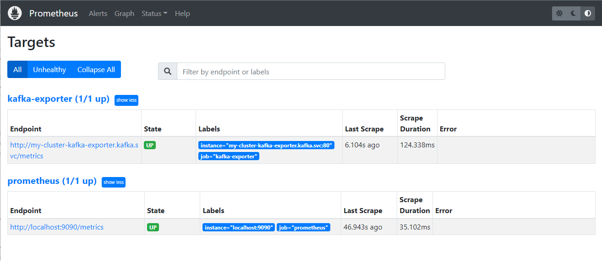

# < Bastion Server Setup >


# 1. K3S 구성(Single mode)


## 1) master node

```sh
# root 권한으로 수행
$ su

$ curl -sfL https://get.k3s.io | sh -s - --write-kubeconfig-mode 644

or

$ curl -sfL https://get.k3s.io | sh -

# 확인
$ kubectl version
WARNING: This version information is deprecated and will be replaced with the output from kubectl version --short.  Use --output=yaml|json to get the full version.
Client Version: version.Info{Major:"1", Minor:"26", GitVersion:"v1.26.5+k3s1", GitCommit:"7cefebeaac7dbdd0bfec131ea7a43a45cb125354", GitTreeState:"clean", BuildDate:"2023-05-27T00:05:40Z", GoVersion:"go1.19.9", Compiler:"gc", Platform:"linux/amd64"}
Kustomize Version: v4.5.7
Server Version: version.Info{Major:"1", Minor:"26", GitVersion:"v1.26.5+k3s1", GitCommit:"7cefebeaac7dbdd0bfec131ea7a43a45cb125354", GitTreeState:"clean", BuildDate:"2023-05-27T00:05:40Z", GoVersion:"go1.19.9", Compiler:"gc", Platform:"linux/amd64"}


# IP/ token 확인
$ cat /var/lib/rancher/k3s/server/node-token
K10f74ce1e1f309271e78114c63d51d5936249e3d379faf1c5c7b2269218f2f9220::server:459b5947077d6e612074e998ff769dd8


# 확인
$ kubectl get nodes -o wide
NAME        STATUS   ROLES                  AGE   VERSION        INTERNAL-IP   EXTERNAL-IP   OS-IMAGE             KERNEL-VERSION    CONTAINER-RUNTIME
bastion03   Ready    control-plane,master   47s   v1.26.5+k3s1   10.158.0.29   <none>        Ubuntu 22.04.2 LTS   5.19.0-1022-gcp   containerd://1.7.1-k3s1


```


## 2) kubeconfig 설정

일반 User가 직접 kubctl 명령 실행을 위해서는 kube config 정보(~/.kube/config) 가 필요하다.

k3s 를 설치하면 /etc/rancher/k3s/k3s.yaml 에 정보가 존재하므로 이를 복사한다. 또한 모든 사용자가 읽을 수 있도록 권한을 부여 한다.

```sh
## root 로 실행
$ su

$ ll /etc/rancher/k3s/k3s.yaml
-rw------- 1 root root 2961 May 14 03:23 /etc/rancher/k3s/k3s.yaml

# 모든 사용자에게 읽기권한 부여
$ chmod +r /etc/rancher/k3s/k3s.yaml

$ ll /etc/rancher/k3s/k3s.yaml
-rw-r--r-- 1 root root 2961 May 14 03:23 /etc/rancher/k3s/k3s.yaml

# 일반 user 로 전환
$ exit


## 사용자 권한으로 실행

$ mkdir -p ~/.kube

$ cp /etc/rancher/k3s/k3s.yaml ~/.kube/config

$ ll ~/.kube/config
-rw-r--r-- 1 song song 2957 May 14 03:44 /home/song/.kube/config

# 자신만 RW 권한 부여
$ chmod 600 ~/.kube/config

$ ls -ltr ~/.kube/config
-rw------- 1 ktdseduuser ktdseduuser 2957 May 13 14:35 /home/ktdseduuser/.kube/config


## 확인
$ kubectl version
Client Version: version.Info{Major:"1", Minor:"26", GitVersion:"v1.26.5+k3s1", GitCommit:"7cefebeaac7dbdd0bfec131ea7a43a45cb125354", GitTreeState:"clean", BuildDate:"2023-05-27T00:05:40Z", GoVersion:"go1.19.9", Compiler:"gc", Platform:"linux/amd64"}
Kustomize Version: v4.5.7
Server Version: version.Info{Major:"1", Minor:"26", GitVersion:"v1.26.5+k3s1", GitCommit:"7cefebeaac7dbdd0bfec131ea7a43a45cb125354", GitTreeState:"clean", BuildDate:"2023-05-27T00:05:40Z", GoVersion:"go1.19.9", Compiler:"gc", Platform:"linux/amd64"}

```

root 권한자가 아닌 다른 사용자도 사용하려면 위와 동일하게 수행해야한다.


## 3) Helm Install

### (1) helm client download

```sh
# 개인 PC WSL
# root 권한으로 수행
$ su


## 임시 디렉토리를 하나 만들자.
$ mkdir -p ~/temp/helm/
  cd ~/temp/helm/

# 다운로드
$ wget https://get.helm.sh/helm-v3.12.0-linux-amd64.tar.gz

# 압축해지
$ tar -zxvf helm-v3.12.0-linux-amd64.tar.gz

# 확인
$ ll linux-amd64/helm
-rwxr-xr-x 1 1001 docker 50597888 May 11 01:35 linux-amd64/helm*

# move
$ mv linux-amd64/helm /usr/local/bin/helm

# 확인
$ ll /usr/local/bin/helm*
-rwxr-xr-x 1 1001 docker 50597888 May 11 01:35 /usr/local/bin/helm*


# 일반유저로 복귀
$ exit


# 확인
$ helm version
version.BuildInfo{Version:"v3.12.0", GitCommit:"c9f554d75773799f72ceef38c51210f1842a1dea", GitTreeState:"clean", GoVersion:"go1.20.3"}


$ helm -n yjsong ls
NAME    NAMESPACE       REVISION        UPDATED STATUS  CHART   APP VERSION

```


### [참고] bitnami repo 추가

- 유명한 charts 들이모여있는 bitnami repo 를 추가해 보자.

```sh
# test# add stable repo
$ helm repo add bitnami https://charts.bitnami.com/bitnami

$ helm repo list

$ helm search repo bitnami
# bitnami 가 만든 다양한 오픈소스 샘플을 볼 수 있다.
NAME                                            CHART VERSION   APP VERSION     DESCRIPTION
bitnami/airflow                                 14.1.3          2.6.0           Apache Airflow is a tool to express and execute...
bitnami/apache                                  9.5.3           2.4.57          Apache HTTP Server is an open-source HTTP serve...
bitnami/appsmith                                0.3.2           1.9.19          Appsmith is an open source platform for buildin...
bitnami/argo-cd                                 4.7.2           2.6.7           Argo CD is a continuous delivery tool for Kuber...
bitnami/argo-workflows                          5.2.1           3.4.7           Argo Workflows is meant to orchestrate Kubernet...
bitnami/aspnet-core                             4.1.1           7.0.5           ASP.NET Core is an open-source framework for we...
bitnami/cassandra                               10.2.2          4.1.1           Apache Cassandra is an open source distributed ...
bitnami/consul                                  10.11.2         1.15.2          HashiCorp Consul is a tool for discovering and ...
...

$ kubectl create ns yjsong

# 설치테스트(샘플: nginx)
$ helm -n yjsong install nginx bitnami/nginx

$ kubectl -n yjsong get all
NAME                         READY   STATUS              RESTARTS   AGE
pod/nginx-68c669f78d-wgnp4   0/1     ContainerCreating   0          10s

NAME            TYPE           CLUSTER-IP    EXTERNAL-IP   PORT(S)        AGE
service/nginx   LoadBalancer   10.43.197.4   <pending>     80:32754/TCP   10s

NAME                    READY   UP-TO-DATE   AVAILABLE   AGE
deployment.apps/nginx   0/1     1            0           10s

NAME                               DESIRED   CURRENT   READY   AGE
replicaset.apps/nginx-68c669f78d   1         1         0       10s

# 간단하게 nginx 에 관련된 deployment / service / pod 들이 설치되었다.


# 설치 삭제
$ helm -n yjsong delete nginx

$ kubectl -n yjsong  get all
No resources found in yjsong namespace.
```


## 4) alias 정의

```sh
# user 권한으로

$ cat > ~/env
alias k='kubectl'
alias kk='kubectl -n kube-system'
alias ky='kubectl -n yjsong'
alias ki='kubectl -n istio-system'
alias kb='kubectl -n bookinfo'
alias kii='kubectl -n istio-ingress'
alias kubectl -n kafka='kubectl -n kafka'
alias krs='kubectl -n redis-system'

#export KUBECONFIG=~/.kube/config-ktdseducluster
export KUBECONFIG=~/.kube/config-localcluster

---

## alias 를 적용하려면 source 명령 수행
$ source ~/env

# booting 시 자동인식하게 하려면 아래 파일 수정
$ vi ~/.bashrc
...
source ~/env


```


## 5) K9S Setup

kubernetes Cluster를 관리하기 위한 kubernetes cli tool 을 설치해 보자.

```sh
# root 권한으로

$ mkdir ~/temp/k9s
  cd  ~/temp/k9s

$ wget https://github.com/derailed/k9s/releases/download/v0.27.4/k9s_Linux_amd64.tar.gz
$ tar -xzvf k9s_Linux_amd64.tar.gz

$ ll
-rw-r--r-- 1  501 staff    10174 Mar 22  2021 LICENSE
-rw-r--r-- 1  501 staff    35702 May  7 16:54 README.md
-rwxr-xr-x 1  501 staff 60559360 May  7 17:01 k9s*
-rw-r--r-- 1 root root  18660178 May  7 17:03 k9s_Linux_amd64.tar.gz

$ cp ./k9s /usr/local/bin/

$ ll /usr/local/bin/
-rwxr-xr-x  1 root root 60559360 May 15 13:05 k9s*


# 일반 사용자로 전환
$ exit 

# 실행
$ k9s

```


## 6) Clean up

### (1) node 제거

#### Cordon

현재 노드에 배포된 Pod은 그대로 유지하면서, 추가적인 Pod의 배포를 제한하는 명령어

```
$ kubectl uncordon <node-name>

$ kubectl cordon <node-name>
```

`kubectl drain` 혹은 `kubectl cordon` 명령어를 적용한 노드는 `SechedulingDisabled` 상태가 되어 더 이상 Pod이 scheduling되지 않는다.`kubectl uncordon`은 노드의 이러한 `SchedulingDisabled` 상태를 제거하여 노드에 Pod이 정상적으로 스케쥴링 될 수 있도록 복구하는 명령어이다.


#### Drain

노드에 존재하는 모든 Pod을 제거하여 노드를 비우고, Pod들을 다른 노드에 새롭게 스케쥴링하는 명령어
drain 과정에 cordon이 포함되어 있다고 볼 수 있다.

```sh
$ kubectl get nodes
NAME                   STATUS   ROLES                       AGE    VERSION
ktds-k3s-master-stpc   Ready    control-plane,etcd,master   4h4m   v1.26.4+k3s1
ktds-k3s-master-vlhj   Ready    control-plane,etcd,master   4h2m   v1.26.4+k3s1
ktds-k3s-master-wwfs   Ready    control-plane,etcd,master   4h2m   v1.26.4+k3s1
ktds-k3s-worker-9zmq   Ready    <none>                      171m   v1.26.4+k3s1
ktds-k3s-worker-b47j   Ready    <none>                      171m   v1.26.4+k3s1
ktds-k3s-worker-ncz7   Ready    <none>                      171m   v1.26.4+k3s1
ktds-k3s-worker-w2z4   Ready    <none>                      171m   v1.26.4+k3s1
ktds-k3s-worker-xmpb   Ready    <none>                      171m   v1.26.4+k3s1


$ kubectl drain ktds-k3s-worker-9zmq --ignore-daemonsets 
  kubectl drain ktds-k3s-worker-b47j --ignore-daemonsets 
  kubectl drain ktds-k3s-worker-ncz7 --ignore-daemonsets 
  kubectl drain ktds-k3s-worker-w2z4 --ignore-daemonsets 
  kubectl drain ktds-k3s-worker-xmpb --ignore-daemonsets 


$ kubectl get nodes
NAME                STATUS                     ROLES                       AGE     VERSION
ktds-k3s-master01   Ready                      control-plane,etcd,master   64m     v1.26.4+k3s1
ktds-k3s-master02   Ready                      control-plane,etcd,master   17m     v1.26.4+k3s1
ktds-k3s-master03   Ready                      control-plane,etcd,master   9m37s   v1.26.4+k3s1
ktds-k3s-worker01   Ready,SchedulingDisabled   control-plane,etcd,master   7m51s   v1.26.4+k3s1
ktds-k3s-worker02   Ready,SchedulingDisabled   control-plane,etcd,master   7m37s   v1.26.4+k3s1


```


#### Node Delete

```sh
# drain 작업 이후
$ kubectl delete node ktds-k3s-worker-9zmq
 kubectl delete node ktds-k3s-worker-b47j
 kubectl delete node ktds-k3s-worker-ncz7
 kubectl delete node ktds-k3s-worker-w2z4
 kubectl delete node ktds-k3s-worker-xmpb

```


### (2) k3s uninstall

```sh
## uninstall
$ sh /usr/local/bin/k3s-killall.sh
  sh /usr/local/bin/k3s-uninstall.sh
  
```


# 2. 기타 Tool Setup


## 1) apt install 

```sh
# root 로

$ apt update

$ apt install vim


$ apt install tree


$ apt install iputils-ping

$ apt install net-tools


$ apt install netcat


$ apt install unzip


$ apt install git
 


$ apt install podman
$ podman version
Version:      3.4.2
API Version:  3.4.2
Go Version:   go1.15.2
Built:        Thu Jan  1 09:00:00 1970
OS/Arch:      linux/amd64


```


# < Kafka Setup >

Strimzi Kafka 를 Setup 한다.


# 1. Strimzi Cluster Operator Install

srimzi  operator 를 install 한다.


## 1) namespace 생성

strimzi operator 와 kafka cluster 를 kafka namespace 에 설치해야 한다.  worker node 를 준비한후 kafka namespace 를 생성하자.

```sh
# namespace 생성
$ kubectl create ns kafka

# 확인
$ kubectl get ns kafka
NAME              STATUS   AGE
kafka             Active   11s


# alias 설정
$ alias kkf='kubectl -n kafka'
```


## 2) Strimzi  download


- 해당 사이트(https://strimzi.io/downloads/) 에서 해당 버젼을 다운로드 받는다.

```sh
$ mkdir -p ~/temp/strimzi
  cd ~/temp/strimzi

# download
$ wget https://github.com/strimzi/strimzi-kafka-operator/releases/download/0.39.0/strimzi-0.39.0.zip
# $ wget https://github.com/strimzi/strimzi-kafka-operator/releases/download/0.36.1/strimzi-0.36.1.zip


$ ll
-rw-rw-r-- 1 ubuntu ubuntu 5649439 Dec 20 19:54 strimzi-0.39.0.zip


$ unzip strimzi-0.39.0.zip
#unzip 이 없으면 설치
# apt install unzip


$ cd  ~/temp/strimzi/strimzi-0.39.0/


$ ll
-rw-r--r--  1 ubuntu ubuntu 62045 Dec 20 17:14 CHANGELOG.md
drwxr-xr-x  4 ubuntu ubuntu  4096 Dec 20 17:15 docs/
drwxr-xr-x 11 ubuntu ubuntu  4096 Dec 20 17:14 examples/
drwxr-xr-x  8 ubuntu ubuntu  4096 Dec 20 17:14 install/

```


* 제약사항
  * Kubernetes 1.21 이상에 Strimzi 0.39.0 배포가능


## 3) admin 관리자지정


```sh

$ cd  ~/temp/strimzi/strimzi-0.39.0/

$ kubectl create -f install/strimzi-admin

```

- `strimzi-view`사용자가 Strimzi 리소스를 보고 나열할 수 있다.
- `strimzi-admin`사용자는 Strimzi 리소스를 생성, 편집 또는 삭제할 수 있다.


## 3) single name 모드 namespace 설정

- single name 모드로 설치진행
  - strimzi operator 는 다양한 namespace 에서 kafka cluster 를 쉽게 생성할 수 있는 구조로 운영이 가능하다.  
  - 이때 STRIMZI_NAMESPACE 를 설정하여 특정 namespace 만으로 cluster 를 제한 할 수 있다.  
  - 일반적인 경우는 특정 Namespace(kafka)에서만  kafka cluster 를 구성할 수 있도록 설정한다. 
  - 그러므로 아래 중 Single namespace 설정에 해당한다.

```sh
$ cd  ~/temp/strimzi/strimzi-0.39.0

$ sed -i 's/namespace: .*/namespace: kafka/' ./install/cluster-operator/*RoleBinding*.yaml

```


## 4) Operator Deploy

- kafka namespace 를 watch 할 수 있는 권한 부여

```sh
$ cd  ~/temp/strimzi/strimzi-0.39.0

# 1) Deploy the CRDs
$ kubectl -n kafka create -f ./install/cluster-operator/


# 2) CRD 확인
$ kubectl -n kafka get crd
NAME                                       CREATED AT
...
kafkabridges.kafka.strimzi.io              2024-02-24T06:48:09Z
kafkaconnectors.kafka.strimzi.io           2024-02-24T06:48:09Z
kafkaconnects.kafka.strimzi.io             2024-02-24T06:48:08Z
kafkamirrormaker2s.kafka.strimzi.io        2024-02-24T06:48:09Z
kafkamirrormakers.kafka.strimzi.io         2024-02-24T06:48:09Z
kafkanodepools.kafka.strimzi.io            2024-02-24T06:48:09Z
kafkarebalances.kafka.strimzi.io           2024-02-24T06:48:09Z
kafkas.kafka.strimzi.io                    2024-02-24T06:48:08Z
kafkatopics.kafka.strimzi.io               2024-02-24T06:48:08Z
kafkausers.kafka.strimzi.io                2024-02-24T06:48:08Z
...

#  *.*.strimzi.io 라는 CRD 가 생성되었다.


# operator 설치 확인
$ kubectl -n kafka get deploy
NAME                       READY   UP-TO-DATE   AVAILABLE   AGE
strimzi-cluster-operator   0/1     1            0           60s


$ kubectl -n kafka get pod
NAME                                        READY   STATUS    RESTARTS   AGE
strimzi-cluster-operator-7bb5468c59-qlb44   1/1     Running   0          74s


# operator pod log 확인
$ kubectl -n kafka logs -f deploy/strimzi-cluster-operator
...
2023-06-10 12:48:42 INFO  ClusterOperator:136 - Setting up periodic reconciliation for namespace kafka
2023-06-10 12:48:42 INFO  Main:208 - Cluster Operator verticle started in namespace kafka without label selector

# Cluster Operator verticle started  메세지가 나오면 정상설치 완료 


```


# 2. Kafka Cluster 생성


## 1) Kafka Cluster 생성


### (1) Kafka cluster 생성

> scram -512  인증 방식의 Cluster생성

#### git clone

```sh
$ mkdir -p ~/githubrepo
  cd ~/githubrepo

$ git clone https://github.com/ssongman/ktds-edu-kafka.git

```


#### kafka cluster 생성

node pool이 없는 zookeeper 기반 kafka 클러스터를 생성한다.

※ 노드 풀은 Kafka 노드 집합에 대한 구성을 제공한다. 노드 풀을 사용하면 동일한 Kafka 클러스터 내에서 노드가 서로 다른 구성을 가질 수 있다.

```sh
$ cd ~/githubrepo/ktds-edu-kafka

$ cat ./kafka/strimzi/kafka/12.kafka-ephemeral-auth.yaml

apiVersion: kafka.strimzi.io/v1beta2
kind: Kafka
metadata:
  name: my-cluster
spec:
  kafka:
    version: 3.6.1
    replicas: 3
    authorization:
      type: simple
    listeners:
      - name: plain
        port: 9092
        type: internal
        tls: false
        authentication:
          type: scram-sha-512
      - name: tls
        port: 9093
        type: internal
        tls: true
    config:
      offsets.topic.replication.factor: 2
      transaction.state.log.replication.factor: 2
      transaction.state.log.min.isr: 2
      default.replication.factor: 2
      min.insync.replicas: 1
      inter.broker.protocol.version: "3.6"
    storage:
      type: ephemeral
  zookeeper:
    replicas: 3
    storage:
      type: ephemeral
  entityOperator:
    topicOperator: {}
    userOperator: {}

# kafka Cluster 생성
$ kubectl -n kafka apply -f ./kafka/strimzi/kafka/12.kafka-ephemeral-auth.yaml


# log확인
# strimzi operator 확인
$ kubectl -n kafka  logs -f -l name=strimzi-cluster-operator
...
...
2023-06-04 05:29:50 INFO  KafkaRoller:611 - Reconciliation #1(watch) Kafka(kafka/my-cluster): Dynamic update of pod my-cluster-kafka-0/0 was successful.


# or 
$ kubectl -n kafka  logs -f deploy/strimzi-cluster-operator


```

- 인증메커니즘

  - SASL 은 인증 및 보안 서비스를 제공하는 프레임워크이다.
  - 위 yaml 파일의 인증방식은 scram-sha-512  방식인데 이는 SASL 이 지원하는 메커니즘 중 하나이며 Broker 를 SASL 구성로 구성한다.


### (2) Kafka Cluster 확인

```sh

$ kkf get pod -w

$ kkf get pod
NAME                                         READY   STATUS    RESTARTS   AGE
my-cluster-entity-operator-d44f86494-cqp5b   3/3     Running   0          2m4s
my-cluster-kafka-0                           1/1     Running   0          2m56s
my-cluster-kafka-1                           1/1     Running   0          2m56s
my-cluster-kafka-2                           1/1     Running   0          2m56s
my-cluster-zookeeper-0                       1/1     Running   0          3m39s
my-cluster-zookeeper-1                       1/1     Running   0          3m38s
my-cluster-zookeeper-2                       1/1     Running   0          3m38s
strimzi-cluster-operator-fd6fb56f6-csrr4     1/1     Running   0          23h

# kafka broker 3개와  zookeeper 3개 실행된것을 확인 할 수 있다.


# Kafka Cluster 확인
$ kkf get kafka
NAME         DESIRED KAFKA REPLICAS   DESIRED ZK REPLICAS   READY   WARNINGS
my-cluster   3                        3                     True

# kafka Cluster 의 ready 상태가 True 인것을 확인하자.


```


### (3) [참고] Kafka cluster 생성(No 인증)

아래는 인증없이 접근 가능한 kafka cluster 를 생성하는 yaml 이므로 참고만 하자.

```sh
$ cd ~/githubrepo/ktds-edu-kafka

$ cat ./kafka/strimzi/kafka/11.kafka-ephemeral-no-auth.yaml
apiVersion: kafka.strimzi.io/v1beta2
kind: Kafka
metadata:
  name: my-cluster
  namespace: kafka
spec:
  kafka:
    version: 3.4.0
    replicas: 3
    listeners:
      - name: plain
        port: 9092
        type: internal
        tls: false
      - name: tls
        port: 9093
        type: internal
        tls: true
    config:
      offsets.topic.replication.factor: 3
      transaction.state.log.replication.factor: 3
      transaction.state.log.min.isr: 2
      default.replication.factor: 3
      min.insync.replicas: 2
      inter.broker.protocol.version: "3.4"
    storage:
      type: ephemeral
  zookeeper:
    replicas: 3
    storage:
      type: ephemeral
  entityOperator:
    topicOperator: {}
    userOperator: {}


```


## 2)  KafkaUser

- kafka cluster 생성시 scram-sha-512 type 의 authentication 를 추가했다면 반드시 KafkaUser 가 존재해야 한다.

- KafkaUser 를 생성하면 secret 에 Opaque 가 생성되며 향후 인증 password 로 사용된다.
- 어떤 topic 에 어떻게 접근할지 에 대한 ACL 기능을 추가할 수 있다.


### (1) User 정책

아래와 같이 ACL (Access Control List) 정책을 지정할 수 있다.

- sample user 별 설명

```
ㅇ my-user
my 로 시작하는 모든 topic을 처리할 수 있음
my 로 시작하는 모든 group을 Consume 가능

ㅇ edu-user
edu 로 시작하는 모든 topic을 처리할 수 있음
edu 로 시작하는 모든 group을 Consume 가능

ㅇ order-user
order로 시작하는 모든 topic을 처리할 수 있음
order로 시작하는 모든 group을 Consume 가능

ㅇ order-user-readonly
order로 시작하는 모든 topic을 읽을 수 있음
order로 시작하는 모든 group을 Consume 가능
```


### (2) my-edu-admin 생성

#### KafkaUser 생성

```sh
$ cd ~/githubrepo/ktds-edu-kafka

$ cat ./kafka/strimzi/user/11.my-edu-admin.yaml
---
apiVersion: kafka.strimzi.io/v1beta2
kind: KafkaUser
metadata:
  name: my-edu-admin
  labels:
    strimzi.io/cluster: my-cluster
  namespace: kafka
spec:
  authentication:
    type: scram-sha-512
  authorization:
    type: simple
    acls:
      - operation: All
        resource:
          type: topic
          name: my
          patternType: prefix
      - operation: All
        resource:
          name: my
          patternType: prefix
          type: group
      - operation: All
        resource:
          type: topic
          name: edu
          patternType: prefix
      - operation: All
        resource:
          name: edu
          patternType: prefix
          type: group
---


# KafkaUser 생성 명령 실행
$ kubectl -n kafka apply -f ./kafka/strimzi/user/11.my-edu-admin.yaml

# kafkauser 확인
$ kubectl -n kafka get kafkauser
NAME           CLUSTER      AUTHENTICATION   AUTHORIZATION   READY
my-edu-admin   my-cluster   scram-sha-512    simple          True


# Ready 상태가 True인것을 확인하자.
```

- ACL 권한설명

  - my~  또는 edu 로 시작하는 topic 을 모두 처리가능
  - ex) my-board-create,  my-board-update,  edu-topic
  - ACLs Operation 
    * 관련링크 : https://docs.confluent.io/platform/current/kafka/authorization.html

  

  

#### password 확인

```sh
$ kubectl -n kafka get secret my-edu-admin
NAME           TYPE     DATA   AGE
my-edu-admin   Opaque   2      47s


$ kubectl -n kafka get secret my-edu-admin -o yaml
...


$ kubectl -n kafka get secret my-edu-admin -o jsonpath='{.data.password}' | base64 -d
OHN7HzcDIg9dDlF3NIwAoHRCgvP8oFoo
WEFbBWUYalMFrcd9WLd8vWvsYCq5Mvdu
boAjdSR2pb8fftkl2r9GgZN4vOO7kby9


# user/pass 
## Cloud 기준 : my-user / WEFbBWUYalMFrcd9WLd8vWvsYCq5Mvdu
## Cloud 기준 : my-edu-admin / boAjdSR2pb8fftkl2r9GgZN4vOO7kby9

```


### (3) my-user 생성

#### KafkaUser 생성

```sh
$ cd ~/githubrepo/ktds-edu-kafka

$ cat ./kafka/strimzi/user/12.my-user.yaml
---
apiVersion: kafka.strimzi.io/v1beta2
kind: KafkaUser
metadata:
  name: my-user
  labels:
    strimzi.io/cluster: my-cluster
  namespace: kafka
spec:
  authentication:
    type: scram-sha-512
  authorization:
    type: simple
    acls:
      - operations: All
        resource:
          type: topic
          name: my
          patternType: prefix
      - operation: All
        resource:
          name: my
          patternType: prefix
          type: group
---


# KafkaUser 생성 명령 실행
$ kubectl -n kafka apply -f ./kafka/strimzi/user/12.my-user.yaml

# kafkauser 확인
$ kubectl -n kafka get kafkauser
NAME           CLUSTER      AUTHENTICATION   AUTHORIZATION   READY
my-edu-admin   my-cluster   scram-sha-512    simple          True
my-user        my-cluster   scram-sha-512    simple          True


# Ready 상태가 True인것을 확인하자.
```

- ACL 권한설명

  - my~  또는 edu 로 시작하는 topic 을 모두 처리가능
  - ex) my-board-create,  my-board-update,  edu-topic

  

  

#### password 확인

```sh
$ kubectl -n kafka get secret my-user
NAME      TYPE     DATA   AGE
my-user   Opaque   2      28s


$ kubectl -n kafka get secret my-user -o jsonpath='{.data.password}' | base64 -d
McUI8xslZvTgp9ApNWygNDLi0cJLblPD
NYQN3Hn7W2PF4z5faR5LdJws40AXbLPt
WQOq7MWlytkD6YItgoMRldW1HfCpuASt

# user/pass 
## Cloud 기준 : my-user / NYQN3Hn7W2PF4z5faR5LdJws40AXbLPt
## Cloud 기준 : my-user / WQOq7MWlytkD6YItgoMRldW1HfCpuASt

```


### (4) edu-user 생성

#### KafkaUser 생성

```sh
$ cd ~/githubrepo/ktds-edu-kafka

$ cat ./kafka/strimzi/user/13.edu-user.yaml
---
apiVersion: kafka.strimzi.io/v1beta2
kind: KafkaUser
metadata:
  name: edu-user
  labels:
    strimzi.io/cluster: my-cluster
  namespace: kafka
spec:
  authentication:
    type: scram-sha-512
  authorization:
    type: simple
    acls:
      - operations: All
        resource:
          type: topic
          name: edu
          patternType: prefix
      - operation: All
        resource:
          name: edu
          patternType: prefix
          type: group
---


# KafkaUser 생성 명령 실행
$ kubectl -n kafka apply -f ./kafka/strimzi/user/13.edu-user.yaml

# kafkauser 확인
$ kubectl -n kafka get kafkauser
NAME           CLUSTER      AUTHENTICATION   AUTHORIZATION   READY
edu-user       my-cluster   scram-sha-512    simple          True
my-edu-admin   my-cluster   scram-sha-512    simple          True
my-user        my-cluster   scram-sha-512    simple          True


# Ready 상태가 True인것을 확인하자.
```

- ACL 권한설명

  - my~  또는 edu 로 시작하는 topic 을 모두 처리가능
  - ex) my-board-create,  my-board-update,  edu-topic

  

  

#### password 확인 - ★

```sh
$ kubectl -n kafka get secret edu-user
NAME       TYPE     DATA   AGE
edu-user   Opaque   2      21s


$ kubectl -n kafka get secret edu-user -o jsonpath='{.data.password}' | base64 -d
iUfOLiK9LM4QxwTMYnjOQHrG0gJiwQpa
nxRcaiHkAOi9YhaFcm3zn6STlWyqivCf
oXTjENLJMvdKV6CbQmU2NX0e87Rezxhc


# user/pass 
## Cloud 기준 : edu-user / oXTjENLJMvdKV6CbQmU2NX0e87Rezxhc

```


### (5) [참고] kafkauser Sample

#### Sample1

```yaml
apiVersion: kafka.strimzi.io/v1beta2
kind: KafkaUser
metadata:
  name: my-user
  labels:
    strimzi.io/cluster: my-cluster
spec:
  authentication:
    type: tls
  authorization:
    type: simple
    acls:
      # Example consumer Acls for topic my-topic using consumer group my-group
      - resource:
          type: topic
          name: my-topic
          patternType: literal
        operations:
          - Describe
          - Read
        host: "*"
      - resource:
          type: group
          name: my-group
          patternType: literal
        operations:
          - Read
        host: "*"
      # Example Producer Acls for topic my-topic
      - resource:
          type: topic
          name: my-topic
          patternType: literal
        operations:
          - Create
          - Describe
          - Write
        host: "*"

```


#### Sample2

```yaml
apiVersion: kafka.strimzi.io/v1beta2
kind: KafkaUser
metadata:
  name: my-user
  labels:
    strimzi.io/cluster: my-cluster
  namespace: kafka
spec:
  authentication:
    type: scram-sha-512
  authorization:
    type: simple
    acls:
      - operations:
          - Describe
          - Read
          - Write
        resource:
          type: topic
          name: my
          patternType: prefix
      - operation: All
        resource:
          name: my
          patternType: prefix
          type: group
```


## 3) KafkaTopic


### (1) Topic 정책 

앞서 KafkaUser 의 ACL 기능을 이용해서 kafka topic 을 제어하는 방법을 확인했다.  

my~  또는 edu 로 시작하는 topic 을 모두 처리가능하므로 my-topic 이라는 이름으로 topic 을 생성해 보자.


### (2) KafkaTopic 생성

```sh
$ cd ~/githubrepo/ktds-edu-kafka

$ cat ./kafka/strimzi/topic/11.kafka-topic.yaml
---
apiVersion: kafka.strimzi.io/v1beta2
kind: KafkaTopic
metadata:
  name: my-topic
  labels:
    strimzi.io/cluster: my-cluster
  namespace: kafka
spec:
  partitions: 3
  replicas: 2
  config:
    #retention.ms: 7200000      # 2 hour
    retention.ms: 86400000      # 24 hours
    segment.bytes: 1073741824   # 1GB


# topic 생성 명령 실행
$ kubectl -n kafka apply -f ./kafka/strimzi/topic/11.kafka-topic.yaml


# topic 생성 확인
$ kubectl -n kafka get kafkatopic my-topic
NAME       CLUSTER      PARTITIONS   REPLICATION FACTOR   READY
my-topic   my-cluster   3            3                    True

```


### (3) Topic  상세 확인

```sh

$ kubectl -n kafka get kafkatopic my-topic -o yaml
---
apiVersion: kafka.strimzi.io/v1beta2
kind: KafkaTopic
metadata:
  annotations:
    kubectl.kubernetes.io/last-applied-configuration: |
      {"apiVersion":"kafka.strimzi.io/v1beta2","kind":"KafkaTopic","metadata":{"annotations":{},"labels":{"strimzi.io/cluster":"my-cluster"},"name":"my-topic","namespace":"kafka"},"spec":{"config":{"retention.ms":86400000,"segment.bytes":1073741824},"partitions":3,"replicas":2}}
  creationTimestamp: "2024-02-24T07:11:52Z"
  finalizers:
  - strimzi.io/topic-operator
  generation: 1
  labels:
    strimzi.io/cluster: my-cluster
  name: my-topic
  namespace: kafka
  resourceVersion: "626120"
  uid: 9cebaf5f-241d-4f74-8679-003d4154ecb8
spec:
  config:
    retention.ms: 86400000
    segment.bytes: 1073741824
  partitions: 3
  replicas: 2
status:
  conditions:
  - lastTransitionTime: "2024-02-24T07:11:53.031100599Z"
    status: "True"
    type: Ready
  observedGeneration: 1
  topicName: my-topic
---


```

- status 에서 true, ready 임을 확인하자.


### [참고] ICIS-TR Topic Name 정책

topiic 명칭을 어떻게 정하는지에 대해서 다양한 시나리오를 생각해 볼 수 있다. 아래 특정 프로젝트의 topic name 정책을 살펴보자.

- topic 정책 및 샘플

```
# 정책
[Part명]-[서비스명]-[서브도메인]-[사용자정의]


# 샘플
order-intl-board-create
order-intl-board-update
order-intl-board-delete

bill-intl-board-create
bill-intl-board-update
bill-intl-board-delete

rater-intl-board-create
rater-intl-board-update
rater-intl-board-delete
```


# 3. Accessing Kafka


## 1) Internal Access


### (1) Kafka Cluster Service 확인


```sh
$ kubectl -n kafka get svc
NAME                          TYPE        CLUSTER-IP     EXTERNAL-IP   PORT(S)                                        AGE
my-cluster-kafka-bootstrap    ClusterIP   10.43.36.193   <none>        9091/TCP,9092/TCP,9093/TCP                     7m27s
my-cluster-kafka-brokers      ClusterIP   None           <none>        9090/TCP,9091/TCP,8443/TCP,9092/TCP,9093/TCP   7m27s
my-cluster-zookeeper-client   ClusterIP   10.43.185.61   <none>        2181/TCP                                       8m1s
my-cluster-zookeeper-nodes    ClusterIP   None           <none>        2181/TCP,2888/TCP,3888/TCP                     8m1s


$ kubectl -n kafka get pod
NAME                                         READY   STATUS    RESTARTS   AGE
my-cluster-entity-operator-d44f86494-cqp5b   3/3     Running   0          11m
my-cluster-kafka-0                           1/1     Running   0          12m
my-cluster-kafka-1                           1/1     Running   0          12m
my-cluster-kafka-2                           1/1     Running   0          12m
my-cluster-zookeeper-0                       1/1     Running   0          13m
my-cluster-zookeeper-1                       1/1     Running   0          13m
my-cluster-zookeeper-2                       1/1     Running   0          13m
strimzi-cluster-operator-fd6fb56f6-csrr4     1/1     Running   0          23h


$ kubectl -n kafka get pod -o wide
NAME                                          READY   STATUS    RESTARTS   AGE     IP           NODE          NOMINATED NODE   READINESS GATES
my-cluster-entity-operator-5cc7644697-2fvkc   2/2     Running   0          6m18s   10.42.8.5    worker03      <none>           <none>
my-cluster-kafka-0                            1/1     Running   0          6m49s   10.42.8.4    worker03      <none>           <none>
my-cluster-kafka-1                            1/1     Running   0          6m49s   10.42.7.4    worker02      <none>           <none>
my-cluster-kafka-2                            1/1     Running   0          6m49s   10.42.6.4    worker01      <none>           <none>
my-cluster-zookeeper-0                        1/1     Running   0          7m23s   10.42.8.3    worker03      <none>           <none>
my-cluster-zookeeper-1                        1/1     Running   0          7m23s   10.42.7.3    worker02      <none>           <none>
my-cluster-zookeeper-2                        1/1     Running   0          7m23s   10.42.1.28   master02.c1   <none>           <none>
strimzi-cluster-operator-7bb5468c59-qlb44     1/1     Running   0          25m     10.42.6.3    worker01      <none>           <none>


```

- my-cluster-kafka-bootstrap 이 일반 kubernetes service 이며 POD 로 트래픽을 RR 방식으로 연결한다.
- my-cluster-kafka-brokers 는 ip 가 없는 headless service 이다. 그러므로 pod 명을 붙여서 DNS 로 사용된다.
  - headless service 사용예시
    - my-cluster-kafka-0.my-cluster-kafka-brokers.kafka.svc
    - my-cluster-kafka-1.my-cluster-kafka-brokers.kafka.svc
    - my-cluster-kafka-2.my-cluster-kafka-brokers.kafka.svc

- 우리는 Cluster 내에서  my-cluster-kafka-bootstrap:9092 로 접근을 시도할 것이다.


### (2) kafkacat 로 확인

Kubernetes Cluster 내에서 kafka 접근 가능여부를 확인하기 위해 kafka Client 용 app 인 kafkacat 을 설치하자.


#### kafkacat 설치

```sh
# kafka cat 설치
$ kubectl -n kafka create deploy kafkacat \
    --image=confluentinc/cp-kafkacat:latest \
    -- sleep 365d

# 설치진행 확인
$ kubectl -n kafka get pod
NAME                                         READY   STATUS              RESTARTS   AGE
kafkacat-5b845776c4-c7tmh                     0/1     ContainerCreating   0               4s


## READY 상태가 1/1 로 변할때까지 대기...


# pod 내부로 진입( bash 명령 수행)
$ kubectl -n kafka exec -it deploy/kafkacat -- bash
[appuser@kafkacat-7648db7f48-wg4hn ~]$


```


#### ※ 참고

windows 환경의 gitbash 를 이용해 pod 내부명령을 수행한다면 prompt 가 보이지 않을수도 있다.

이런경우 windows 에서 linux 체제와 호환이 되지 않아서 발생하는 이슈이다.

아래와 같이 winpty 를 붙인다면 prompt 가 보이니 참고하자.

```sh
# pod 내부명령 수행
$ winpty kubectl -n kafka exec -it deploy/kafkacat -- bash

```


#### pub/sub test

id/pass 가 필요

```sh

# pod 내부로 진입( bash 명령 수행)
$ kubectl -n kafka exec -it deploy/kafkacat -- bash


export BROKERS=my-cluster-kafka-bootstrap:9092
export KAFKAUSER=my-user
export PASSWORD=WQOq7MWlytkD6YItgoMRldW1HfCpuASt        ## 개인별 passwrod 붙여넣자.   위 3.2 KafkaUser 를 참고하자. 
export TOPIC=my-topic
export GROUP=my-topic-group
 

 
## topic 리스트
kafkacat -b $BROKERS \
  -X security.protocol=SASL_PLAINTEXT \
  -X sasl.mechanisms=SCRAM-SHA-512 \
  -X sasl.username=$KAFKAUSER \
  -X sasl.password=$PASSWORD -L

Metadata for all topics (from broker -1: sasl_plaintext://my-cluster-kafka-bootstrap:9092/bootstrap):
 3 brokers:
  broker 0 at my-cluster-kafka-0.my-cluster-kafka-brokers.kafka.svc:9092
  broker 2 at my-cluster-kafka-2.my-cluster-kafka-brokers.kafka.svc:9092
  broker 1 at my-cluster-kafka-1.my-cluster-kafka-brokers.kafka.svc:9092 (controller)
 1 topics:
  topic "my-topic" with 3 partitions:
    partition 0, leader 1, replicas: 1,0, isrs: 1,0
    partition 1, leader 0, replicas: 0,2, isrs: 0,2
    partition 2, leader 2, replicas: 2,1, isrs: 2,1


## 위 내용중 3개의 brokers 주소를 잘 이해하자.
## 위주소는 headless service 이용한 pod dns 이다.


## consumer
kafkacat -b $BROKERS \
  -X security.protocol=SASL_PLAINTEXT \
  -X sasl.mechanisms=SCRAM-SHA-512 \
  -X sasl.username=$KAFKAUSER \
  -X sasl.password=$PASSWORD \
  -X group.id=$GROUP \
  -t $TOPIC -C -o -5


## terminal 을 한개 더 실행하여 위 환경변수 인식후 아래 producer 를 실행하자.
## producer
kafkacat -b $BROKERS \
  -X security.protocol=SASL_PLAINTEXT \
  -X sasl.mechanisms=SCRAM-SHA-512 \
  -X sasl.username=$KAFKAUSER \
  -X sasl.password=$PASSWORD \
  -t $TOPIC -P -X acks=1

# 임의의 text 실행
```


- Consumer 결과확인

```
% Reached end of topic my-topic [2] at offset 0
% Reached end of topic my-topic [0] at offset 0
% Reached end of topic my-topic [1] at offset 0

asdf
% Reached end of topic my-topic [2] at offset 1
asdf
% Reached end of topic my-topic [2] at offset 2
asdf
asd
% Reached end of topic my-topic [1] at offset 2
fsad
% Reached end of topic my-topic [2] at offset 3
f
% Reached end of topic my-topic [2] at offset 4
sdf
% Reached end of topic my-topic [1] at offset 3
asdfasd
% Reached end of topic my-topic [0] at offset 1
fas
% Reached end of topic my-topic [0] at offset 2
fsda
% Reached end of topic my-topic [0] at offset 3
fsa
% Reached end of topic my-topic [1] at offset 4

```

- offset 값이 partition 단위로 증가됨을 할 수 있다.


#### [참고] kafkacat 추가명령

```sh
## consumer group
kafkacat -b $BROKERS \
  -X security.protocol=SASL_PLAINTEXT \
  -X sasl.mechanisms=SCRAM-SHA-512 \
  -X sasl.username=$KAFKAUSER \
  -X sasl.password=$PASSWORD \
  -t $TOPIC -C \
  -X group.id=my-board-group


## consumer group
kafkacat -b $BROKERS \
  -X security.protocol=SASL_PLAINTEXT \
  -X sasl.mechanisms=SCRAM-SHA-512 \
  -X sasl.username=$KAFKAUSER \
  -X sasl.password=$PASSWORD \
  -t $TOPIC -C \
  -X group.id=order-intl-board-group -o -5


## producer : 입력모드
kafkacat -b $BROKERS \
  -X security.protocol=SASL_PLAINTEXT \
  -X sasl.mechanisms=SCRAM-SHA-512 \
  -X sasl.username=$KAFKAUSER \
  -X sasl.password=$PASSWORD \
  -t $TOPIC -P -X acks=1
 


## 대량 발송 모드
$ cat > msg.txt
---
{"eventName":"a","num":1,"title":"a", "writeId":"", "writeName": "", "writeDate":"" }
---

## producer : file mode
kafkacat -b $BROKERS \
  -X security.protocol=SASL_PLAINTEXT \
  -X sasl.mechanisms=SCRAM-SHA-512 \
  -X sasl.username=$KAFKAUSER \
  -X sasl.password=$PASSWORD \
  -t $TOPIC -P ./msg.txt


## producer : while
while true; do kafkacat -b $BROKERS \
  -X security.protocol=SASL_PLAINTEXT \
  -X sasl.mechanisms=SCRAM-SHA-512 \
  -X sasl.username=$KAFKAUSER \
  -X sasl.password=$PASSWORD \
  -t $TOPIC -P ./msg.txt; done;

```


### (3) python 확인

Kubernetes Cluster 내에서 kafka 접근 가능여부를 확인하기 위해 python 을 설치후 kafka 에 connect 해 보자.


#### python  설치

```sh
# bastion Serve 에서 수행

# python deploy
$ kubectl -n kafka create deploy python --image=python:3.9 -- sleep 365d


# 설치진행 확인
$ kubectl -n kafka get pod
...
python-fb57f7bd4-4w6pz                       1/1     Running   0              32s
...

## READY 상태가 1/1 로 변할때까지 대기...


# python pod 내부로 진입( bash 명령 수행)
$ kubectl -n kafka exec -it deploy/python -- bash


```


#### python library install

kafka 에 접근하기 위해서 kafka-python 을 설치해야 한다.

```bash
# python pod 내부에서
$ pip install kafka-python

Collecting kafka-python
  Downloading kafka_python-2.0.2-py2.py3-none-any.whl (246 kB)
     ━━━━━━━━━━━━━━━━━━━━━━━━━━━━━━━━━━━━━━━━ 246.5/246.5 KB 7.2 MB/s eta 0:00:00
Installing collected packages: kafka-python
Successfully installed kafka-python-2.0.2


```


#### kafka host 확인

```sh
## internal 접근을 위한 host 확인

$ apt update 
$ apt install netcat         <-- 이전버젼
$ apt install netcat-openbsd

nc -zv my-cluster-kafka-bootstrap.kafka.svc 9092
nc -zv my-cluster-kafka-0.my-cluster-kafka-brokers.kafka.svc 9092
nc -zv my-cluster-kafka-1.my-cluster-kafka-brokers.kafka.svc 9092
nc -zv my-cluster-kafka-2.my-cluster-kafka-brokers.kafka.svc 9092

```


#### consumer

consumer 실행을 위해서 python cli 환경으로 들어가자.

```sh
$ python

Python 3.9.18 (main, Feb 13 2024, 10:54:04)
[GCC 12.2.0] on linux
Type "help", "copyright", "credits" or "license" for more information.


>>>

```


CLI 환경에서 아래  Python 명령을 하나씩 실행해 보자.

```python

from kafka import KafkaConsumer


# 개인환경으로 변경
bootstrap_servers='my-cluster-kafka-bootstrap:9092'
sasl_plain_username='my-user'
sasl_plain_password='WQOq7MWlytkD6YItgoMRldW1HfCpuASt'             ## 개인별 passwrod 붙여넣자.   위 3.2 KafkaUser 를 참고하자. 
topic_name='my-topic' 
group_id='my-topic-group'

consumer = KafkaConsumer(bootstrap_servers=bootstrap_servers,
                        security_protocol="SASL_PLAINTEXT",
                        sasl_mechanism='SCRAM-SHA-512',
                        sasl_plain_username=sasl_plain_username,
                        sasl_plain_password=sasl_plain_password,
                        auto_offset_reset='earliest',
                        enable_auto_commit= True,
                        group_id=group_id)


# 접속한 계정으로 확인가능한 topic 목록들을 확인할 수 있다.
consumer.topics()

# 사용할 topic 지정(구독)
consumer.subscribe(topic_name)

# 구독 확인
consumer.subscription()
#{'my-topic'}            <-- 해당 Topic 이 출력되어야 한다.


# 메세지 읽기
for message in consumer:
   print("topic=%s partition=%d offset=%d: key=%s value=%s" %
        (message.topic,
          message.partition,
          message.offset,
          message.key,
          message.value))

# 수신대기중....


'''
topic=my-topic partition=0 offset=38: key=None value=b'{"eventName":"a","num":88,"title":"a", "writeId":"", "writeName": "", "writeDate":"" }'
topic=my-topic partition=0 offset=39: key=None value=b'{"eventName":"a","num":90,"title":"a", "writeId":"", "writeName": "", "writeDate":"" }'
topic=my-topic partition=0 offset=40: key=None value=b'{"eventName":"a","num":96,"title":"a", "writeId":"", "writeName": "", "writeDate":"" }'
'''
```


#### producer

producer 실행을 위해서 별도의 terminal 을 실행한 후 python cli 환경으로 들어가자.

```sh
# python pod 내 진입(bash 실행)
$ kubectl -n kafka exec -it deploy/python -- bash
root@python-7d59455985-ml8vw:/#


$ python
Python 3.9.18 (main, Feb 13 2024, 10:54:04)
[GCC 12.2.0] on linux
Type "help", "copyright", "credits" or "license" for more information.


>>>

```


internal 에서 접근시에는 인증서가 없는  9092 port 접근이므로 사용되는 protocol은 SASL_PLAINTEXT 이다.CLI 환경에서 아래  Python 명령을 하나씩 실행해 보자.

```python

from kafka import KafkaProducer
from time import sleep

# 개인환경으로 변경
bootstrap_servers='my-cluster-kafka-bootstrap:9092'
sasl_plain_username='my-user'
sasl_plain_password='WQOq7MWlytkD6YItgoMRldW1HfCpuASt'             ## 개인별 passwrod 붙여넣자.   위 3.2 KafkaUser 를 참고하자. 
topic_name='my-topic'


producer = KafkaProducer(bootstrap_servers=bootstrap_servers,
                        security_protocol="SASL_PLAINTEXT",
                        sasl_mechanism='SCRAM-SHA-512',
                        sasl_plain_username=sasl_plain_username,
                        sasl_plain_password=sasl_plain_password)

# 아래 명령 부터 Consumer 수신을 관찰하면서 수행하자.
producer.send(topic_name, b'python test1')
producer.send(topic_name, b'python test2')
producer.send(topic_name, b'{"eventName":"a","num":%d,"title":"a", "writeId":"", "writeName": "", "writeDate":"" }' % 1)

# 10000건을 0.5초에 한번씩 발송해보자.
for i in range(10000):
    print(i)
    sleep(0.5)
    producer.send(topic_name, b'{"eventName":"a","num":%d,"title":"a", "writeId":"", "writeName": "", "writeDate":"" }' % i)

    
# 테스트를 끝내려면 Ctrl + C 로 중지하자.
# POD Terminal 을 빠져나가려면 exit(Ctrl+D)
```


- 대량 발송(성능테스트)

```python

# 만건 테스트
import time
start_time = time.time() # 시작시간
for i in range(10000):
    print(i)
    producer.send('my-topic', b'{"eventName":"a","num":%d,"title":"a", "writeId":"", "writeName": "", "writeDate":"" }' % i)

end_time = time.time() # 종료시간
print("duration time :", end_time - start_time)  # 현재시각 - 시작시간 = 실행 시간


# 테스트 결과
# duration time
   # 1만건 : 3.686084747314453
   # 1만건 : 4.461207389831543
   # 10만건 : 36.04079532623291
   # 10만건 : 44.05281901359558


# 속도 : 약 2,000 TPS
```


- 참고

```python
# 2만건 테스트
for i in range(10001, 20000):
    print(i)
    producer.send('my-topic', b'{"eventName":"a","num":%d,"title":"a", "writeId":"", "writeName": "", "writeDate":"" }' % i)
    
```


- python 종료시 : Ctrl+D 


## 2) External Access(Node Port)

참고: https://strimzi.io/blog/2019/04/17/accessing-kafka-part-1/

- Strimzi 는 외부에서 접근가능하도록  다양한 기능을 제공함

- Strimzi 가 제공하는 외부 접근방식
  - Node port
  - Ingress
  - Openshift Route
  - Load Balancer


그중 Node Port 접근 방식을 알아보자.


### (1) GCP LB 확인

#### Node IP 확인

- 외부에 접근가능한 node port 를 인식할 수 있는 IP를 확인하자.
- 이 IP 는 아래 Node Port 등록시 nip host 에 사용된다.
- Cloud 에서는 Virtual Router IP 를 사용한다.

```sh
# GCP Cloud 에서 Load Balancer 셋팅 및 방화벽 설정 수행

43.203.62.69 32100
43.203.62.69 32200
43.203.62.69 32201
43.203.62.69 32202

ubuntu@bastion01:~$ nc -zv 43.203.62.69 32100
Connection to 43.203.62.69 32100 port [tcp/*] succeeded!
ubuntu@bastion01:~$ nc -zv 43.203.62.69 32200
Connection to 43.203.62.69 32200 port [tcp/*] succeeded!
ubuntu@bastion01:~$ nc -zv 43.203.62.69 32201
Connection to 43.203.62.69 32201 port [tcp/*] succeeded!
ubuntu@bastion01:~$ nc -zv 43.203.62.69 32202
Connection to 43.203.62.69 32202 port [tcp/*] succeeded!


```


#### NodePort Listener 등록

- Kafka Cluster 를 수정모드로 변경하여 node port  listener 를 삽입하자.
- node Port 를 직접 명시할 수 있다.
- AdvertisedHost 필드에는 DNS 이름이나 IP 주소를 표기할 수 있다.

```sh
$ kubectl -n kafka edit kafka my-cluster

apiVersion: kafka.strimzi.io/v1beta2
kind: Kafka
metadata:
  name: my-cluster
  namespace: kafka
  ...
spec:
  ...
    listeners:
    - authentication:
        type: scram-sha-512
      name: plain
      port: 9092
      tls: false
      type: internal
    - name: tls
      port: 9093
      tls: true
      type: internal
    
    ## nodeport type 등록 - 아래내용을 삽입 하자.
    - name: external
      port: 9094
      type: nodeport
      tls: false
      authentication:
        type: scram-sha-512
      configuration:
        bootstrap:
          nodePort: 32100
        brokers:
        - broker: 0
          advertisedHost: my-cluster.kafka.43.203.62.69.nip.io    # LB IP 사용
          nodePort: 32200
        - broker: 1
          advertisedHost: my-cluster.kafka.43.203.62.69.nip.io    # LB IP 사용
          nodePort: 32201
        - broker: 2
          advertisedHost: my-cluster.kafka.43.203.62.69.nip.io    # LB IP 사용
          nodePort: 32202

...
---


# 상태 확인
# my-cluster-kafka-0
# my-cluster-kafka-1
# my-cluster-kafka-2 순서로 rolling 방식으로 재기동 될것이다.

## broker pod 3개 가 모두 재기동 될때까지 대기한다.
## 약 3분~5분 정도 소요된다.


# strimzi operator 확인
$ kubectl -n kafka  logs -f -l name=strimzi-cluster-operator
$ kubectl -n kafka  logs -f deploy/strimzi-cluster-operator
2023-06-04 06:07:25 INFO  StrimziPodSetController:313 - Reconciliation #93(watch) StrimziPodSet(kafka/my-cluster-kafka): StrimziPodSet will be reconciled
2023-06-04 06:07:25 INFO  StrimziPodSetController:349 - Reconciliation #93(watch) StrimziPodSet(kafka/my-cluster-kafka): reconciled
2023-06-04 06:07:25 INFO  StrimziPodSetController:313 - Reconciliation #94(watch) StrimziPodSet(kafka/my-cluster-kafka): StrimziPodSet will be reconciled
2023-06-04 06:07:25 INFO  StrimziPodSetController:349 - Reconciliation #94(watch) StrimziPodSet(kafka/my-cluster-kafka): reconciled
2023-06-04 06:07:26 INFO  StrimziPodSetController:313 - Reconciliation #95(watch) StrimziPodSet(kafka/my-cluster-kafka): StrimziPodSet will be reconciled
2023-06-04 06:07:26 INFO  StrimziPodSetController:349 - Reconciliation #95(watch) StrimziPodSet(kafka/my-cluster-kafka): reconciled
2023-06-04 06:07:29 INFO  StrimziPodSetController:313 - Reconciliation #96(watch) StrimziPodSet(kafka/my-cluster-kafka): StrimziPodSet will be reconciled
2023-06-04 06:07:29 INFO  StrimziPodSetController:349 - Reconciliation #96(watch) StrimziPodSet(kafka/my-cluster-kafka): reconciled
2023-06-04 06:07:31 INFO  StrimziPodSetController:313 - Reconciliation #97(watch) StrimziPodSet(kafka/my-cluster-kafka): StrimziPodSet will be reconciled
2023-06-04 06:07:31 INFO  StrimziPodSetController:349 - Reconciliation #97(watch) StrimziPodSet(kafka/my-cluster-kafka): reconciled


# strimzi pod 확인
$ kubectl -n kafka get pod
NAME                                         READY   STATUS    RESTARTS   AGE
kafkacat-686d9c5977-bdsgw                    1/1     Running   0          26m
my-cluster-entity-operator-d44f86494-cqp5b   3/3     Running   0          39m
my-cluster-kafka-0                           1/1     Running   0          47s
my-cluster-kafka-1                           1/1     Running   0          2m41s
my-cluster-kafka-2                           1/1     Running   0          100s
my-cluster-zookeeper-0                       1/1     Running   0          40m
my-cluster-zookeeper-1                       1/1     Running   0          40m
my-cluster-zookeeper-2                       1/1     Running   0          40m
strimzi-cluster-operator-fd6fb56f6-csrr4     1/1     Running   0          24h

# pod들이 재기동 되면서 node port 들이 적용된다.
# 시간이 다소 소요됨. 약 5분 이내

```


#### Kafka Cluster 확인

```sh
# 확인
$ kubectl -n kafka get kafka my-cluster
NAME         DESIRED KAFKA REPLICAS   DESIRED ZK REPLICAS   READY   WARNINGS
my-cluster   3                        3                     True


$ kubectl -n kafka get kafka my-cluster -o yaml
...
status:
...
  - addresses:
    - host: my-cluster.kafka.43.203.62.69.nip.io
      port: 32100
    bootstrapServers: my-cluster.kafka.43.203.62.69.nip.io:32100
    name: external
  observedGeneration: 2
  operatorLastSuccessfulVersion: 0.39.0

---

## name: external 이 표기되어야 정상 반영 된 것이다.


$ kubectl -n kafka get svc
NAME                                  TYPE        CLUSTER-IP      EXTERNAL-IP   PORT(S)                                        AGE
my-cluster-kafka-0                    NodePort    10.43.173.138   <none>        9094:32200/TCP                                 29m
my-cluster-kafka-1                    NodePort    10.43.250.0     <none>        9094:32201/TCP                                 29m
my-cluster-kafka-2                    NodePort    10.43.230.147   <none>        9094:32202/TCP                                 29m
my-cluster-kafka-bootstrap            ClusterIP   10.43.36.193    <none>        9091/TCP,9092/TCP,9093/TCP                     62m
my-cluster-kafka-brokers              ClusterIP   None            <none>        9090/TCP,9091/TCP,8443/TCP,9092/TCP,9093/TCP   62m
my-cluster-kafka-external-bootstrap   NodePort    10.43.146.76    <none>        9094:32100/TCP                                 29m
my-cluster-zookeeper-client           ClusterIP   10.43.185.61    <none>        2181/TCP                                       63m
my-cluster-zookeeper-nodes            ClusterIP   None            <none>        2181/TCP,2888/TCP,3888/TCP                     63


```

- 외부에서 접근시 아래 주소로 cluster내부에 있는 kafka 에 접근 할 수 있다.

  ```
  bootstrap  : my-cluster.kafka.localhost.43.203.62.69.nip.io:32100
  broker0    : my-cluster.kafka.localhost.43.203.62.69.nip.io:32200
  broker1    : my-cluster.kafka.localhost.43.203.62.69.nip.io:32201
  broker2    : my-cluster.kafka.localhost.43.203.62.69.nip.io:32202
  ```


#### Port  검사

* Cluster node 에 접근할 수 있는 곳에서 검사

```sh
# bastion server 에서 확인

NAME          STATUS   ROLES                       AGE     VERSION        INTERNAL-IP     EXTERNAL-IP   OS-IMAGE             KERNEL-VERSION   CONTAINER-RUNTIME
master01.c1   Ready    control-plane,etcd,master   6d6h    v1.28.6+k3s2   172.31.14.177   <none>        Ubuntu 22.04.3 LTS   6.2.0-1018-aws   containerd://1.7.11-k3s2
master02.c1   Ready    control-plane,etcd,master   6d6h    v1.28.6+k3s2   172.31.13.98    <none>        Ubuntu 22.04.3 LTS   6.2.0-1018-aws   containerd://1.7.11-k3s2
master03.c1   Ready    control-plane,etcd,master   6d6h    v1.28.6+k3s2   172.31.8.197    <none>        Ubuntu 22.04.3 LTS   6.2.0-1018-aws   containerd://1.7.11-k3s2
worker01      Ready    <none>                      3h45m   v1.28.6+k3s2   172.31.2.193    <none>        Ubuntu 22.04.3 LTS   6.2.0-1018-aws   containerd://1.7.11-k3s2
worker02      Ready    <none>                      3h45m   v1.28.6+k3s2   172.31.4.202    <none>        Ubuntu 22.04.3 LTS   6.2.0-1018-aws   containerd://1.7.11-k3s2
worker03      Ready    <none>                      3h45m   v1.28.6+k3s2   172.31.3.53     <none>        Ubuntu 22.04.3 LTS   6.2.0-1018-aws   containerd://1.7.11-k3s2


# port 가 살아 있는지 master01 node 로 connect test 하여 검사해보자.
$ nc -zv 172.31.14.177 32100
$ nc -zv 172.31.14.177 32200
$ nc -zv 172.31.14.177 32201
$ nc -zv 172.31.14.177 32202
Connection to 10.128.0.35 32200 port [tcp/*] succeeded

# 존재하지 않는 port 는 아래와 같이 refused 된다.
$ nc -zv 172.31.14.177 32203
nc: connect to 10.128.0.35 port 32203 (tcp) failed: Connection refused


```


* 외부에서 검사

```sh
# local pc에서 확인

# port 가 살아 있는지 master01 node 로 connect test 하여 검사해보자.
$ nc -zv 43.203.62.69 32100

# 존재하지 않는 port 는 아래와 같이 refused 된다.
$ nc -zv 43.203.62.69 32203
nc: connect to 10.128.0.35 port 32203 (tcp) failed: Connection refused


```


### (2) kafkacat 로 확인

Local PC(Cluster 외부) 에서  kafka 접근 가능여부를 확인하기 위해 kafkacat 을 docker 로 PC 에 설치하자.

#### docker run

kafkacat 을 docker 로 설치한다.

docker CLI terminal 에서 수행한다.

```sh
# 실행
$ docker run --name kafkacat -d --user root confluentinc/cp-kafkacat:latest sleep 365d


# 확인
$ docker ps -a
CONTAINER ID   IMAGE                             COMMAND                  CREATED          STATUS                      PORTS     NAMES
3a0ae7a699ad   confluentinc/cp-kafkacat:latest   "sleep 365d"             2 weeks ago      Up 2 seconds                          kafkacat


# docker 내부로 진입( bash 명령 수행)
$ docker exec -it kafkacat bash
[root@3a0ae7a699ad appuser]#

```


#### pub/sub 확인

password  와 주소를 확인한 후 변경하자.

```sh

# docker 내부로 진입( bash 명령 수행)
$ docker exec -it kafkacat bash

export BROKERS=my-cluster.kafka.43.203.62.69.nip.io:32100,\
my-cluster.kafka.43.203.62.69.nip.io:32200,\
my-cluster.kafka.43.203.62.69.nip.io:32201,\
my-cluster.kafka.43.203.62.69.nip.io:32202

or

export BROKERS=my-cluster.kafka.43.203.62.69.nip.io:32100
export KAFKAUSER=my-user
export PASSWORD=WQOq7MWlytkD6YItgoMRldW1HfCpuASt        ## passwrod 붙여넣자.   위 3.2 KafkaUser 를 참고하자. 
export TOPIC=my-topic
export GROUP=my-topic-group


## topic 리스트
kafkacat -b $BROKERS \
  -X security.protocol=SASL_PLAINTEXT \
  -X sasl.mechanisms=SCRAM-SHA-512 \
  -X sasl.username=$KAFKAUSER \
  -X sasl.password=$PASSWORD -L
---
Metadata for all topics (from broker -1: sasl_plaintext://my-cluster.kafka.43.203.62.69.nip.io:32100/bootstrap):
 3 brokers:
  broker 0 at my-cluster.kafka.43.203.62.69.nip.io:32200
  broker 2 at my-cluster.kafka.43.203.62.69.nip.io:32202
  broker 1 at my-cluster.kafka.43.203.62.69.nip.io:32201 (controller)
 1 topics:
  topic "my-topic" with 3 partitions:
    partition 0, leader 0, replicas: 0,1,2, isrs: 0,1,2
    partition 1, leader 2, replicas: 2,0,1, isrs: 0,1,2
    partition 2, leader 1, replicas: 1,2,0, isrs: 0,1,2
---
Metadata for all topics (from broker -1: sasl_plaintext://my-cluster.kafka.43.203.62.69.nip.io:32100/bootstrap):
 3 brokers:
  broker 0 at my-cluster.kafka.43.203.62.69.nip.io:32200
  broker 2 at my-cluster.kafka.43.203.62.69.nip.io:32202 (controller)
  broker 1 at my-cluster.kafka.43.203.62.69.nip.io:32201
 1 topics:
  topic "my-topic" with 3 partitions:
    partition 0, leader 1, replicas: 1,0, isrs: 0,1
    partition 1, leader 0, replicas: 0,2, isrs: 0,2
    partition 2, leader 2, replicas: 2,1, isrs: 2,1


# 3개의 brokers 를 확인하자.
# Internal 에서 확인했을때와 주소가 다른 것을 확인할 수 있다.
# local PC 에서 접근가능한 3개의 nodeport 주소가 kafka discovery 에 의해 반환되었다.
# kafka discovery protocol 임을 이해하자.


## consumer
kafkacat -b $BROKERS \
  -X security.protocol=SASL_PLAINTEXT \
  -X sasl.mechanisms=SCRAM-SHA-512 \
  -X sasl.username=$KAFKAUSER \
  -X sasl.password=$PASSWORD \
  -X group.id=$GROUP \
  -t $TOPIC -C \
  -o -5
  

# -o -5 <-- 현재 offset 에서 5번째 이전 부터 보여줌(partition별)


## terminal 을 한개 더 실행하여 위 환경변수 인식후 아래 producer 를 실행하자.
## producer : 입력모드
kafkacat -b $BROKERS \
  -X security.protocol=SASL_PLAINTEXT \
  -X sasl.mechanisms=SCRAM-SHA-512 \
  -X sasl.username=$KAFKAUSER \
  -X sasl.password=$PASSWORD \
  -t $TOPIC -P -X acks=1
  

```


### (3) python 확인

#### Container run

python image 를 Container 로 설치한다.

##### docker

```sh
## docker 실행
$ docker run --name python --user root --rm -d python:3.9 sleep 365d

# python 확인
$ docker ps -a
CONTAINER ID   IMAGE                             COMMAND                  CREATED          STATUS          PORTS     NAMES
a225dc4c3dd7   python:3.9                        "sleep 365d"             4 weeks ago      Up 20 seconds             python


# Container 내부로 진입( bash 명령 수행)
$ docker exec -it python bash
root@a225dc4c3dd7:/#

```


##### podman

```sh
## podman 실행
$ podman run --name python --user root -d python:3.9 sleep 365d

# python 확인
$ podman ps -a
CONTAINER ID  IMAGE                         COMMAND     CREATED        STATUS            PORTS       NAMES
fb231e23f9f1  docker.io/library/python:3.9  sleep 365d  2 seconds ago  Up 2 seconds ago              python


# Container 내부로 진입( bash 명령 수행)
$ podman exec -it python bash
root@a225dc4c3dd7:/#

```


#### python library install

python 을 이용해서 kafka 에 접근하기 위해서는 kafka 가아닌 kafka-python 을 설치해야 한다.

```bash
$ pip install kafka-python
```


#### kafka host 확인

```sh
## external 접근을 위한 host (nodeport 기준)

$ apt update
  apt install netcat-openbsd

nc -zv my-cluster.kafka.43.203.62.69.nip.io 32100
nc -zv my-cluster.kafka.43.203.62.69.nip.io 32200
nc -zv my-cluster.kafka.43.203.62.69.nip.io 32201
nc -zv my-cluster.kafka.43.203.62.69.nip.io 32202


```


#### consumer

consumer 실행을 위해서 python cli 환경으로 들어가자.

```sh
$ python
Python 3.9.18 (main, Feb 13 2024, 10:54:04)
[GCC 12.2.0] on linux
Type "help", "copyright", "credits" or "license" for more information.

>>>

```


CLI 환경에서 아래  Python 명령을 하나씩 실행해 보자.

```python
from kafka import KafkaConsumer

# 개인환경으로 변경
bootstrap_servers='my-cluster.kafka.43.203.62.69.nip.io:32100'
sasl_plain_username='my-user'
sasl_plain_password='WQOq7MWlytkD6YItgoMRldW1HfCpuASt'             ## 개인별 passwrod 붙여넣자.   위 3.2 KafkaUser 를 참고하자. 
topic_name='my-topic'
group_id='my-topic-group'


consumer = KafkaConsumer(bootstrap_servers=bootstrap_servers,
                        security_protocol="SASL_PLAINTEXT",
                        sasl_mechanism='SCRAM-SHA-512',
                        sasl_plain_username=sasl_plain_username,
                        sasl_plain_password=sasl_plain_password,
                        ssl_check_hostname=True,
                        auto_offset_reset='earliest',
                        enable_auto_commit= True,
                        group_id=group_id)

# 접속한 계정으로 확인가능한 topic 목록들을 확인할 수 있다.
consumer.topics()

# 사용할 topic 지정(구독)
consumer.subscribe(topic_name)

# 구독 확인
consumer.subscription()
#{'my-topic'}            <-- 해당 Topic 이 출력되어야 한다.


# 메세지 읽기
for message in consumer:
   print("topic=%s partition=%d offset=%d: key=%s value=%s" %
        (message.topic,
          message.partition,
          message.offset,
          message.key,
          message.value))

# 수신대기중....

'''
---
topic=my-topic partition=0 offset=38: key=None value=b'{"eventName":"a","num":88,"title":"a", "writeId":"", "writeName": "", "writeDate":"" }'
topic=my-topic partition=0 offset=39: key=None value=b'{"eventName":"a","num":90,"title":"a", "writeId":"", "writeName": "", "writeDate":"" }'
topic=my-topic partition=0 offset=40: key=None value=b'{"eventName":"a","num":96,"title":"a", "writeId":"", "writeName": "", "writeDate":"" }'
'''
```


#### producer

producer 실행을 위해서 별도의 terminal 을 실행한 후 python cli 환경으로 들어가자.

```sh
# Container 내부로 진입( bash 명령 수행)
$ docker exec -it python bash
root@a225dc4c3dd7:/#


$ python
Python 3.9.18 (main, Feb 13 2024, 10:54:04)
[GCC 12.2.0] on linux
Type "help", "copyright", "credits" or "license" for more information.

>>>

```


CLI 환경에서 아래  Python 명령을 하나씩 실행해 보자.

```python
from kafka import KafkaProducer
from time import sleep

# 개인환경으로 변경
bootstrap_servers='my-cluster.kafka.43.203.62.69.nip.io:32100'
sasl_plain_username='my-user'
sasl_plain_password='WQOq7MWlytkD6YItgoMRldW1HfCpuASt'             ## 개인별 passwrod 붙여넣자.   위 3.2 KafkaUser 를 참고하자. 
topic_name='my-topic'


producer = KafkaProducer(bootstrap_servers=bootstrap_servers,
                        security_protocol="SASL_PLAINTEXT",
                        sasl_mechanism='SCRAM-SHA-512',
                        ssl_check_hostname=True,
                        sasl_plain_username=sasl_plain_username,
                        sasl_plain_password=sasl_plain_password)

# 아래 명령 부터 Consumer 수신을 관찰하면서 수행하자.
producer.send(topic_name, b'python test1')
producer.send(topic_name, b'python test2')
producer.send(topic_name, b'{"eventName":"a","num":%d,"title":"a", "writeId":"", "writeName": "", "writeDate":"" }' % 1)

# 10000건을 1초에 한번씩 발송해보자.
for i in range(10000):
    print(i)
    sleep(0.5)
    producer.send(topic_name, b'{"eventName":"a","num":%d,"title":"a", "writeId":"", "writeName": "", "writeDate":"" }' % i)

# 테스트를 끝내려면 Ctrl + C 로 중지하자.

```


- 대량 발송(성능테스트)

```python
# 만건 테스트
import time
start_time = time.time() # 시작시간
for i in range(10000):
    print(i)
    producer.send(topic_name, b'{"eventName":"a","num":%d,"title":"a", "writeId":"", "writeName": "", "writeDate":"" }' % i)

end_time = time.time() # 종료시간
print("duration time :", end_time - start_time)  # 현재시각 - 시작시간 = 실행 시간


# duration time
   # 1만건 : 7.333464860916138
   # 1만건 : 7.20307469367981
   # 10만건 :  65.2125780582428
   # 10만건 :  80.76845932006836

# 속도 : 약 1,538 TPS  ( = 100,000 / 65)

```

- 결론
  - 일반적으로 External 이 Internal 보다 network 부하가 심해서 속도가 훨씬 느리다.
  - 하지만 우리가 테스트한 환경은 동일 PC 에서 실행하므로 속도가 거의 동일한 점을 참고하자.


- 참고

```python
# 2만건 테스트
for i in range(10001, 20000):
    print(i)
    producer.send(topic_name, b'{"eventName":"a","num":%d,"title":"a", "writeId":"", "writeName": "", "writeDate":"" }' % i)
    
```


- python 종료시 : Ctrl+D 


# 3. Strimzi Clean up

Bastion Server 에서의 Strimzi 실습이 완료되었다. 불필요한 리소스 사용을 없애기 위해서 깨끗히 삭제하도록 하자.

필요시 추후 삭제하도록 하자.


## 1) Strimzi All Clean Up

```sh
# bastion Server 에서...

# 1) client tool clean up
$ kubectl -n kafka delete deploy kafkacat
  kubectl -n kafka delete deploy python


# 2) 확인
$ kubectl -n kafka get kafkauser
  kubectl -n kafka get kafkatopic
  kubectl -n kafka get all


# 3) kafka resource clean up
$ kubectl -n kafka delete kafkauser my-edu-admin
  kubectl -n kafka delete kafkauser edu-user
  kubectl -n kafka delete kafkauser my-user
  
  kubectl -n kafka delete kafkatopic my-topic  
    kubectl -n kafka delete kafkatopic edu-topic01  
    kubectl -n kafka delete kafkatopic edu-topic01-0
    kubectl -n kafka delete kafkatopic edu-topic014 
    kubectl -n kafka delete kafkatopic edu-topic02  
    kubectl -n kafka delete kafkatopic edu-topic03  
    kubectl -n kafka delete kafkatopic edu-topic04  
    kubectl -n kafka delete kafkatopic edu-topic05  
    kubectl -n kafka delete kafkatopic edu-topic06  
    kubectl -n kafka delete kafkatopic edu-topic07  
    kubectl -n kafka delete kafkatopic edu-topic08  
    kubectl -n kafka delete kafkatopic edu-topic09  
    kubectl -n kafka delete kafkatopic edu-topic10  
    kubectl -n kafka delete kafkatopic edu-topic11  
    kubectl -n kafka delete kafkatopic edu-topic12  
    kubectl -n kafka delete kafkatopic edu-topic13  
    kubectl -n kafka delete kafkatopic edu-topic14  
    kubectl -n kafka delete kafkatopic edu-topic15  
    kubectl -n kafka delete kafkatopic edu-topic16  
    kubectl -n kafka delete kafkatopic edu-topic17  
    kubectl -n kafka delete kafkatopic edu-topic18  
    kubectl -n kafka delete kafkatopic edu-topic19  
    kubectl -n kafka delete kafkatopic edu-topic20  
    kubectl -n kafka delete kafkatopic edu-topic21 
    
  kubectl -n kafka delete kafka my-cluster


# 4) strimzi clean up
$ cd ~/githubrepo/ktds-edu-kafka
$ kubectl -n kafka delete -f ./kafka/strimzi/install/cluster-operator

# 5) kafka namespace clean up
$ kubectl delete namespace kafka

# 6) 확인
$ kubectl -n kafka get kafkauser
  kubectl -n kafka get kafkatopic
  kubectl -n kafka get all

# 7) strimzi directory
$ cd
$ rm -rf ~/temp/strimzi

```


## 2) Container Clean up

```sh
# bastion Server 에서

# 확인
$ docker ps -a
CONTAINER ID  IMAGE                                      COMMAND     CREATED         STATUS             PORTS       NAMES
598840f3a513  docker.io/library/python:3.9               sleep 365d  49 minutes ago  Up 49 minutes ago              python
add15a7fd413  docker.io/confluentinc/cp-kafkacat:latest  sleep 365d  22 minutes ago  Up 22 minutes ago              kafkacat


# 1) Container 삭제
$ docker rm -f python
  docker rm -f kafkacat

$ docker ps -a


```


# 4. Monitoring(Grafana)

모니터링이 필요할 경우 exporter 를 설치후 promtheus와 연동할 수 있다. 


## 1) metric

모니터링이 필요할 경우 아래와 같이 exporter 를 설치후 promtheus와 연동할 수 있다. 


- exporter 기능은 Strimzi에서 제공되는 통합 이미지 내에 포함되어 있음.   

  - strimzi/kafka:0.29.0-kafka-3.2.0    <-- strimzi-cluster-operator 에서 기본 이미지 설정가능
- kafka cluster 에서 위 yaml 파일만 수정후 apply 해도 추가가능.(kafka cluster 를 재설치 하지 않아도 됨.)
- prometheus / grafana 는 일반적인 내용과 동일함.
- grafana 에서는 strimzi dashboard 를 찾아서 import 한다.
- arsenal-cluster-kafka-exporter:9404 로 접근가능


### (1) my-cluster 에 exporter 생성

```sh
$ kubectl -n kafka edit kafka my-cluster
---
apiVersion: kafka.strimzi.io/v1beta2
kind: Kafka
metadata:
  name: my-cluster
  namespace: kafka
  ...
spec:
  entityOperator:
  kafka:
  zookeeper:
  
  ############# 아래 exporter 추가 ################
  kafkaExporter:
    groupRegex: .*
    topicRegex: .*
  ...    
---


```


- exporter pod 생성 여부 확인

```sh
# 확인
$ kubectl -n kafka get pod
NAME                                          READY   STATUS              RESTARTS      AGE
...
my-cluster-kafka-exporter-79b8c986f8-wg259    0/1     ContainerCreating   0             0s
...


## my-cluster-kafka-exporter 가 추가된다.
# strimzi 가 인식하는 시간이 소요되므로 약 3분정도 후 반영된다.

```


### (2) exporter service 생성

exporter service 는 자동으로 생성되지 않는다.

아래와 같이 수동으로 추가해야 한다.

```sh
$ cd ~/githubrepo/ktds-edu-kafka

$ cat ./kafka/strimzi/monitoring/11.my-cluster-kafka-exporter-service.yaml
---
kind: Service
apiVersion: v1
metadata:
  name: my-cluster-kafka-exporter
  namespace: kafka
spec:
  ports:
    - name: http
      protocol: TCP
      port: 80
      targetPort: 9404
  selector:    
    app.kubernetes.io/instance: my-cluster
    app.kubernetes.io/managed-by: strimzi-cluster-operator
    app.kubernetes.io/name: kafka-exporter    
  type: ClusterIP


$ kubectl -n kafka apply -f ./kafka/strimzi/monitoring/11.my-cluster-kafka-exporter-service.yaml


```


- 확인

```sh
$ kkf get svc my-cluster-kafka-exporter
NAME                        TYPE        CLUSTER-IP      EXTERNAL-IP   PORT(S)   AGE
my-cluster-kafka-exporter   ClusterIP   10.43.131.199   <none>        80/TCP    14s

```


- exporter pod 에서 metric 정상 수집 여부 확인

```sh
# my-cluster-kafka-exporter POD 내로 진입(bash 실행)
$ kkf exec -it deploy/my-cluster-kafka-exporter -- bash


# metric 이 유효한지 조회
$ curl localhost:9404/metrics
# HELP go_gc_duration_seconds A summary of the pause duration of garbage collection cycles.
# TYPE go_gc_duration_seconds summary
go_gc_duration_seconds{quantile="0"} 0.00037912
go_gc_duration_seconds{quantile="0.25"} 0.00037912
go_gc_duration_seconds{quantile="0.5"} 0.00037912
go_gc_duration_seconds{quantile="0.75"} 0.00037912
go_gc_duration_seconds{quantile="1"} 0.00037912
go_gc_duration_seconds_sum 0.00037912
go_gc_duration_seconds_count 1
# HELP go_goroutines Number of goroutines that currently exist.
# TYPE go_goroutines gauge
go_goroutines 19
# HELP go_info Information about the Go environment.
# TYPE go_info gauge
go_info{version="go1.17.1"} 1


# 서비스명으로 조회 시도
$ curl my-cluster-kafka-exporter.kafka.svc/metrics
<-- ok
```


## 2) prometheus - helm방식


### (1) 권한부여

- openshift 에서 수행시 anyuid 권한이 필요하다.

```
# 권한부여시
oc adm policy add-scc-to-user    anyuid -z prometheus-server -n kafka

# 권한삭제시
oc adm policy remove-scc-from-user anyuid  -z prometheus-server -n kafka

```


### (2) helm deploy

```sh
# repo추가
$ helm repo add prometheus-community https://prometheus-community.github.io/helm-charts
$ helm repo list
$ helm repo update


# 설치전 기설치여부 확인
$ helm -n kafka list

$ helm search repo prometheus
...
prometheus-community/prometheus                         25.13.0         v2.49.1         Prometheus is a monitoring system and time seri...
...


# Fetch
$ mkdir -p ~/temp/helm/charts/
  cd ~/temp/helm/charts/


$ helm fetch prometheus-community/prometheus

$ ll
-rw-r--r-- 1 ktdseduuser ktdseduuser 59331 Jun  4 12:39 prometheus-22.6.2.tgz
-rw-r--r-- 1 ktdseduuser ktdseduuser 69825 Sep  2 16:34 prometheus-23.4.0.tgz
-rw-r--r-- 1 ubuntu ubuntu 75037 Feb 24 08:45 prometheus-25.13.0.tgz


$ tar -zxvf prometheus-25.13.0.tgz

$ cd ~/temp/helm/charts/prometheus

# helm 실행 dry-run
$ helm -n kafka install prometheus . \
  --set configmapReload.prometheus.enabled=true \
  --set server.enabled=true \
  --set server.image.repository=quay.io/prometheus/prometheus \
  --set server.namespaces[0]=kafka \
  --set server.ingress.enabled=true \
  --set server.ingress.hosts[0]=prometheus.kafka.43.203.62.69.nip.io \
  --set server.persistentVolume.enabled=false \
  --set alertmanager.enabled=false \
  --set kube-state-metrics.enabled=false \
  --set prometheus-node-exporter.enabled=false \
  --set prometheus-pushgateway.enabled=false \
  --dry-run=true > dry-run.yaml


# helm 실행


# 확인
$ helm -n kafka list
NAME            NAMESPACE       REVISION        UPDATED                                 STATUS          CHART                   APP VERSION
prometheus      kafka           1               2023-06-04 12:35:18.418462244 +0000 UTC deployed        prometheus-22.6.2       v2.44.0

NAME            NAMESPACE       REVISION        UPDATED                                 STATUS          CHART                   APP VERSION
prometheus      kafka           1               2023-09-02 16:35:39.831272244 +0000 UTC deployed        prometheus-23.4.0       v2.46.0

NAME            NAMESPACE       REVISION        UPDATED                                 STATUS          CHART                   APP VERSION
prometheus      kafka           1               2024-02-24 08:48:00.012127268 +0000 UTC deployed        prometheus-25.13.0      v2.49.1


## 확인
$ helm -n kafka status prometheus
$ helm -n kafka get all prometheus

```


#### [Troble Shooting] CRB 추가 생성

- 권한 오류가 발생하여 확인하니 helm chart 에 의해서 당연히  설치되어야 할 권한이 생기지 않았다.
- helm chart 오류인듯 하다.
- 아래와 같이 수동으로 생성한다.

```sh
$ kubectl -n kafka apply -f - <<EOF
apiVersion: rbac.authorization.k8s.io/v1
kind: ClusterRoleBinding
metadata:
  labels:
    component: "server"
    app: prometheus
    release: prometheus
    chart: prometheus-15.10.1
    heritage: Helm
  name: prometheus-server
subjects:
  - kind: ServiceAccount
    name: prometheus-server
    namespace: kafka
roleRef:
  apiGroup: rbac.authorization.k8s.io
  kind: ClusterRole
  name: prometheus-server
EOF


$ kubectl -n kafka get ClusterRoleBinding | grep prometheus
```


### (3) prometheus 확인 

```sh
# pod 확인
$ kkf get pod 
NAME                                          READY   STATUS    RESTARTS      AGE
prometheus-server-5b5d787f8d-rb8zz            1/1     Running   0             4m36s
---
prometheus-server-6676478584-cdqlc            2/2     Running   0          87s


# pod log 확인
$ kkf logs -f deploy/prometheus-server


# svc 확인
$ kkf get svc
NAME                                  TYPE        CLUSTER-IP       EXTERNAL-IP   PORT(S)                               AGE
...
prometheus-server                     ClusterIP   10.43.124.104   <none>        80/TCP                                117s
---
prometheus-server                     ClusterIP   10.43.3.91      <none>        80/TCP                                         118s


# ClusterRoleBinding 확인
$ kkf get ClusterRoleBinding prometheus-server
NAME                ROLE                            AGE
prometheus-server   ClusterRole/prometheus-server   36s


$ kubectl -n kafka get ClusterRoleBinding | grep prometheus
prometheus                                             ClusterRole/prometheus                                             6d5h


```


### (4) ingress

````sh
$ cd ~/githubrepo/ktds-edu-kafka

$ cat ./kafka/strimzi/monitoring/21.prometheus-ingress.yaml
---
apiVersion: networking.k8s.io/v1
kind: Ingress
metadata:
  name: prometheus-ingress
spec:
  ingressClassName: traefik
  rules:
  - host: "prometheus.kafka.43.203.62.69.nip.io"
    http:
      paths:
      - path: /
        pathType: Prefix
        backend:
          service:
            name: prometheus-server
            port:
              number: 80


$ kubectl -n kafka apply -f ./kafka/strimzi/monitoring/21.prometheus-ingress.yaml

````

- 확인
  - URL : http://prometheus.kafka.43.203.62.69.nip.io


#### [참고] Openshift Route

openshift 환경일때는 route 를 생성한다.

````sh
$ cd ~/githubrepo/ktds-edu-kafka

$ cat ./kafka/strimzi/monitoring/22.prometheus-route.yaml
---
kind: Route
apiVersion: route.openshift.io/v1
metadata:
  name: prometheus-route
  namespace: kafka-system
  labels:
    app: prometheus
    app.kubernetes.io/managed-by: Helm
    chart: prometheus-15.8.4
    component: server
    heritage: Helm
    release: prometheus
spec:
  host: prometheus.kafka.43.203.62.69.nip.io
  to:
    kind: Service
    name: prometheus-server
    weight: 100
  port:
    targetPort: http
    
$ kubectl -n kafka apply -f ./kafka/strimzi/monitoring/22.prometheus-route.yaml
````


### (5) configmap 정리

- 기존에 존재하는 모든 job_name 을 삭제하고
- kafka-exporter jobname 만 추가하자.

````sh
$ kubectl -n kafka edit configmap prometheus-server
---
kind: ConfigMap
apiVersion: v1
metadata:
  name: prometheus-server
  namespace: kafka
  ...
data:
  ...
  prometheus.yml: |
    global:
      evaluation_interval: 1m
      scrape_interval: 1m
      scrape_timeout: 10s
    rule_files:
    - /etc/config/recording_rules.yml
    - /etc/config/alerting_rules.yml
    - /etc/config/rules
    - /etc/config/alerts
    scrape_configs: 
    
    #### 아래 부분 추가 ####
    - job_name: kafka-exporter
      metrics_path: /metrics
      scrape_interval: 10s
      scrape_timeout: 10s
      static_configs:
      - targets:
        - my-cluster-kafka-exporter.kafka.svc
     ...
````

- 추가후 prometheus server 재기동

```sh
$ kkf get pod
NAME                                          READY   STATUS    RESTARTS      AGE
...
prometheus-server-5dc67b6855-cdm54            1/1     Running   0             24m
...


$ kkf delete pod prometheus-server-5dc67b6855-cdm54
pod "prometheus-server-5dc67b6855-cdm54" deleted


$ kkf get pod
NAME                                          READY   STATUS    RESTARTS      AGE
my-cluster-kafka-exporter-79b8c986f8-wg259    1/1     Running   1 (60m ago)   60m
prometheus-server-5dc67b6855-67xts            0/1     Running   0             9s

```


- target 확인 
  - URL : http://prometheus.kafka.43.203.62.69.nip.io
  - 메뉴 : status / target 에서 아래와 같이 kafka-exporter 가 추가된것을 확인한다.




- metric 확인
  - 메뉴 : Graph

```
kafka_topic_partition_current_offset

```


```
sum(rate(kafka_topic_partition_current_offset{topic="my-topic"}[1m])) by (topic)

sum(rate(kafka_topic_partition_current_offset{topic="edu-topic-01"}[1m])) by (topic)
```


### (6) clean up

```sh
## 삭제시...

$ helm -n kafka delete prometheus 

$ helm -n kafka list

```


## 3) Grafana deploy

- deploy

```sh
$ cd ~/githubrepo/ktds-edu-kafka

$ cat ./kafka/strimzi/monitoring/31.grafana-deployment.yaml
---
apiVersion: apps/v1
kind: Deployment
metadata:
  name: grafana
  namespace: kafka
  labels:
    app: strimzi
spec:
  replicas: 1
  selector:
    matchLabels:
      name: grafana
  template:
    metadata:
      labels:
        name: grafana
    spec:
      containers:
      - name: grafana
        image: docker.io/grafana/grafana:10.2.4
        ports:
        - name: grafana
          containerPort: 3000
          protocol: TCP
        volumeMounts:
        - name: grafana-data
          mountPath: /var/lib/grafana
        - name: grafana-logs
          mountPath: /var/log/grafana
        readinessProbe:
          httpGet:
            path: /api/health
            port: 3000
          initialDelaySeconds: 5
          periodSeconds: 10
        livenessProbe:
          httpGet:
            path: /api/health
            port: 3000
          initialDelaySeconds: 15
          periodSeconds: 20
      volumes:
      - name: grafana-data
        emptyDir: {}
      - name: grafana-logs
        emptyDir: {}


$ kubectl -n kafka apply -f ./kafka/strimzi/monitoring/31.grafana-deployment.yaml
deployment.apps/grafana created

```


- service

```sh
$ cd ~/githubrepo/ktds-edu-kafka

$ cat ./kafka/strimzi/monitoring/32.grafana-svc.yaml
---
apiVersion: v1
kind: Service
metadata:
  name: grafana
  namespace: kafka
  labels:
    app: strimzi
spec:
  ports:
  - name: grafana
    port: 3000
    targetPort: 3000
    protocol: TCP
  selector:
    name: grafana
  type: ClusterIP


$ kubectl -n kafka apply -f ./kafka/strimzi/monitoring/32.grafana-svc.yaml
service/grafana created


```


- ingress

```sh
$ cat ./kafka/strimzi/monitoring/33.grafana-ingress.yaml
---
apiVersion: networking.k8s.io/v1
kind: Ingress
metadata:
  name: grafana-ingress
  annotations:
    kubernetes.io/ingress.class: "traefik"
spec:
  rules:
  - host: "grafana.kafka.43.203.62.69.nip.io"
    http:
      paths:
      - path: /
        pathType: Prefix
        backend:
          service:
            name: grafana
            port:
              number: 3000


$ kubectl -n kafka apply -f ./kafka/strimzi/monitoring/33.grafana-ingress.yaml
ingress.networking.k8s.io/grafana-ingress created

```


- [참고] Openshift Route
  - openshift 환경에서만 사용

```yaml
$ cat ./kafka/strimzi/monitoring/34.grafana-route.yaml
---
kind: Route
apiVersion: route.openshift.io/v1
metadata:
  name: grafana-kafka-route
  namespace: kafka
  labels:
    app: strimzi
spec:
  host: grafana.kafka.43.203.62.69.nip.io
  to:
    kind: Service
    name: grafana
    weight: 100
  port:
    targetPort: grafana
  wildcardPolicy: None
$ kubectl -n kafka apply -f ./kafka/strimzi/monitoring/34.grafana-route.yaml
```


- 로그인

기본 Grafana 사용자 이름과 암호는 모두 admin 이다.


 

## 4) Grafana Monitoring

### (1) Grafana 접속

- URL : http://grafana.kafka.43.203.62.69.nip.io

- User : admin

- Pass : admin -->  adminpass


### (2) promehteus 연동

- 메뉴 : Data Sources / Promehteus 
- URL
  - prometheus-server:80


### (3) strimzi exporter dashboard import

- 메뉴: Dashboards / Manage
- import : 11285입력
- 참고링크 : https://grafana.com/grafana/dashboards/11285-strimzi-kafka-exporter
- or
- strimzi 에서 제공하는 dashboard 
  - examples/metrics/grafana-dashboards


### (4) 확인

http://grafana.kafka.ktcloud.211.254.212.105.nip.io/d/jwPKIsniz/strimzi-kafka-exporter?orgId=1&refresh=5s&from=now-30m&to=now&var-consumergroup=edu-topic-group&var-topic=edu-topic-01


- 메뉴 위치 : Dashboards > Manage > Strimzi Kafka Exporter


## 5) Clean Up

```sh
## 1) Grafana 삭제
cd ~/githubrepo/ktds-edu-kafka
kubectl -n kafka delete -f ./kafka/strimzi/monitoring/31.grafana-deployment.yaml
kubectl -n kafka delete -f ./kafka/strimzi/monitoring/33.grafana-ingress.yaml

## 2) Prometheus 삭제
helm -n kafka delete prometheus 
kubectl -n kafka apply -f ./kafka/strimzi/monitoring/21.prometheus-ingress.yaml
kubectl -n kafka delete ClusterRoleBinding prometheus-server
  
```


# 5. Monitoring(Kafdrop)

참조링크 : https://ricardo-aires.github.io/helm-charts/charts/kafdrop/


## 1) kafdrop install

### (1) properties 확인

#### kafka-my-cluster.properties

```sh

# 1) user / password 확인
$ kubectl -n kafka get secret my-edu-admin -o jsonpath='{.data.sasl\.jaas\.config}' | base64 -d

org.apache.kafka.common.security.scram.ScramLoginModule required username="my-edu-admin" password="boAjdSR2pb8fftkl2r9GgZN4vOO7kby9";


#
$ mkdir -p ~/temp/kafka
  cd ~/temp/kafka

# 2) kafka-my-edu-admin.properties 생성
$ cat > kafka-my-edu-admin.properties
security.protocol=SASL_PLAINTEXT
sasl.mechanism=SCRAM-SHA-512
sasl.jaas.config=org.apache.kafka.common.security.scram.ScramLoginModule required username="my-edu-admin" password="boAjdSR2pb8fftkl2r9GgZN4vOO7kby9";


# 3) kafka_properties base64 암호화
$ export kafka_properties_base64_enc=$(cat kafka-my-edu-admin.properties | base64)
$ echo $kafka_properties_base64_enc


```


### (2) helm install

```sh
$ cd ~/temp/kafka


$ git clone https://github.com/obsidiandynamics/kafdrop

$ cd ~/temp/kafka/kafdrop/chart


# dry-run
# $ helm -n kafka install kafdrop .\
$ helm -n kafka upgrade --install kafdrop .\
    --set kafka.brokerConnect=my-cluster-kafka-bootstrap:9092 \
    --set kafka.properties="$kafka_properties_base64_enc" \
    --set server.servlet.contextPath="/" \
    --set cmdArgs="--topic.deleteEnabled=true --topic.createEnabled=true" \
    --set jvm.opts="-Xms32M -Xmx64M" \
    --set ingress.enabled="true" \
    --set ingress.apiVersion="networking.k8s.io/v1" \
    --set ingress.ingressClassName="traefik" \
    --set ingress.hosts[0]="kafdrop.kafka.43.203.62.69.nip.io" \
    --set ingress.path="/" \
    --set ingress.pathType="Prefix" \
    --dry-run=true


# 참고
    --set image.tag=3.31.0 \
    --set cmdArgs="--message.format=AVRO --schemaregistry.connect=http://localhost:8080" \ #optional
    

# helm 설치


NAME: kafdrop
LAST DEPLOYED: Sat Feb 24 09:24:39 2024
NAMESPACE: kafka
STATUS: deployed
REVISION: 1
TEST SUITE: None
NOTES:
1. Get the application URL by running these commands:
  export NODE_PORT=$(kubectl get --namespace kafka -o jsonpath="{.spec.ports[0].nodePort}" services kafdrop)
  export NODE_IP=$(kubectl get nodes --namespace kafka -o jsonpath="{.items[0].status.addresses[0].address}")
  echo http://$NODE_IP:$NODE_PORT

---

1. Get the application URL by running these commands:
  http://kafdrop.kafka.43.203.62.69.nip.io/


# 확인
$ helm -n kafka ls

NAME            NAMESPACE       REVISION        UPDATED                                 STATUS          CHART                   APP VERSION
kafdrop         kafka           1               2024-02-24 09:24:39.6500492 +0000 UTC   deployed        kafdrop-0.1.0           3.x
kafdrop         kafka           3               2024-02-24 09:35:33.089752637 +0000 UTC deployed        kafdrop-0.1.0           3.x


# 삭제시...
$ helm -n kafka uninstall kafdrop

```


####  확인

```sh

# log 확인
$ kubectl -n kafka logs -f deploy/kafdrop

Writing Kafka properties into kafka.properties
2023-06-10 05:48:38.384  INFO ${sys:PID} [           main] k.Kafdrop$EnvironmentSetupListener       : Initializing JAAS config
2023-06-10 05:48:38.400  INFO ${sys:PID} [           main] k.Kafdrop$EnvironmentSetupListener       : env: null .isSecured kafka: false
2023-06-10 05:48:38.401  INFO ${sys:PID} [           main] k.Kafdrop$EnvironmentSetupListener       : Env: null
2023-06-10 05:48:38.608  INFO 1 [kground-preinit] o.h.v.i.u.Version                        : HV000001: Hibernate Validator 6.2.5.Final
2023-06-10 05:48:38.713  INFO 1 [           main] o.s.b.StartupInfoLogger                  : Starting application using Java 11.0.18 on kafdrop-6d4fb5db44-6944k with PID 1 (started by root in /)
2023-06-10 05:48:38.800  INFO 1 [           main] o.s.b.SpringApplication                  : No active profile set, falling back to 1 default profile: "default"
2023-06-10 05:48:44.260  INFO 1 [           main] i.u.s.s.ServletContextImpl               : Initializing Spring embedded WebApplicationContext
2023-06-10 05:48:44.261  INFO 1 [           main] w.s.c.ServletWebServerApplicationContext : Root WebApplicationContext: initialization completed in 5251 ms
2023-06-10 05:48:44.865  INFO 1 [           main] k.c.KafkaConfiguration                   : Checking truststore file kafka.truststore.jks
2023-06-10 05:48:44.866  INFO 1 [           main] k.c.KafkaConfiguration                   : Checking keystore file kafka.keystore.jks
2023-06-10 05:48:44.867  INFO 1 [           main] k.c.KafkaConfiguration                   : Checking properties file kafka.properties
2023-06-10 05:48:44.867  INFO 1 [           main] k.c.KafkaConfiguration                   : Loading properties from kafka.properties
2023-06-10 05:48:45.287  INFO 1 [           main] k.c.KafkaConfiguration                   : Checking truststore file kafka.truststore.jks
2023-06-10 05:48:45.288  INFO 1 [           main] k.c.KafkaConfiguration                   : Checking keystore file kafka.keystore.jks
2023-06-10 05:48:45.288  INFO 1 [           main] k.c.KafkaConfiguration                   : Checking properties file kafka.properties
2023-06-10 05:48:45.290  INFO 1 [           main] k.c.KafkaConfiguration                   : Loading properties from kafka.properties
2023-06-10 05:48:45.415  INFO 1 [           main] k.s.BuildInfo                            : Kafdrop version: 3.31.0, build time: 2023-03-20T17:07:14.026Z
2023-06-10 05:48:47.606  INFO 1 [           main] o.s.b.a.e.w.EndpointLinksResolver        : Exposing 13 endpoint(s) beneath base path '/actuator'
2023-06-10 05:48:49.548  INFO 1 [           main] i.u.Undertow                             : starting server: Undertow - 2.2.20.Final
2023-06-10 05:48:49.586  INFO 1 [           main] o.x.Xnio                                 : XNIO version 3.8.7.Final
2023-06-10 05:48:49.602  INFO 1 [           main] o.x.n.NioXnio                            : XNIO NIO Implementation Version 3.8.7.Final
2023-06-10 05:48:49.654  INFO 1 [           main] o.j.t.Version                            : JBoss Threads version 3.1.0.Final
2023-06-10 05:48:49.738  INFO 1 [           main] o.s.b.w.e.u.UndertowWebServer            : Undertow started on port(s) 9000 (http)
2023-06-10 05:48:50.813  INFO 1 [           main] o.s.b.StartupInfoLogger                  : Started application in 13.148 seconds (JVM running for 15.8)
2023-06-10 05:48:56.114  INFO 1 [  XNIO-1 task-1] i.u.s.s.ServletContextImpl               : Initializing Spring DispatcherServlet 'dispatcherServlet'
2023-06-10 05:48:56.117  INFO 1 [  XNIO-1 task-1] o.s.w.s.FrameworkServlet                 : Initializing Servlet 'dispatcherServlet'
2023-06-10 05:48:56.134  INFO 1 [  XNIO-1 task-1] o.s.w.s.FrameworkServlet                 : Completed initialization in 17 ms


# health check
$ kubectl -n kafka exec -it deploy/kafdrop -- curl localhost:9000/actuator/health
{"status":"UP","groups":["liveness","readiness"]}


```


## 2) ingress 


```sh
$ cd ~/temp/kafka

$ cat > 11.kafdrop-ingress.yaml
apiVersion: networking.k8s.io/v1
kind: Ingress
metadata:
  annotations:
    kubernetes.io/ingress.class: traefik
  name: kafdrop-ingress
spec:
  rules:
  - host: kafdrop.kafka.43.203.62.69.nip.io
    http:
      paths:
      - backend:
          service:
            name: kafdrop
            port:
              number: 9000
        path: /
        pathType: Prefix


$ kubectl -n kafka apply -f 11.kafdrop-ingress.yaml


$ kubectl -n kafka get ingress
NAME                CLASS     HOSTS                                   ADDRESS                                                                 PORTS   AGE
kafdrop-ingress     <none>    kafdrop.kafka.43.203.62.69.nip.io      10.128.0.35,10.128.0.36,10.128.0.38,10.128.0.39,10.208.0.2,10.208.0.3   80      12s
...


```


## 3) Clean Up

```sh


# 1) kafdrop 삭제
$ helm -n kafka uninstall kafdrop


# 2) delete kafdrop-ingress 
$ kubectl -n kafka delete ingress kafdrop-ingress

# 3) 
$ rm -rf ~/temp/kafka
  
```