# Kafka 개념

# 1. Kafka 개요

apache kafka : https://kafka.apache.org/

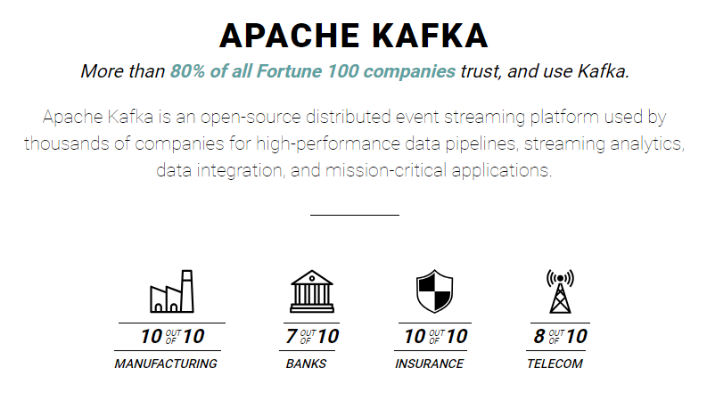

## 1) 개요

Kafka는 여러대의 분산 서버에서 대량의 데이터를 처리하는 분산 메시징 시스템

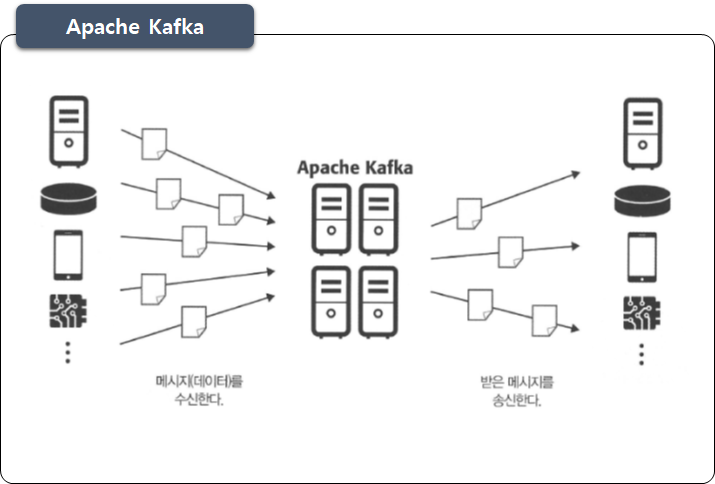

- 카프카는 미국 링크드인에서 웹사이트 활동 추적 목적으로 개발되어 2011년 오픈소스로 공개됨

- 당시 링크드인이 실현하려는 목표는 아래와 같음
  - 높은 처리량으로 실시간 처리한다.

  - 임의의 타이밍에서 데이터를 읽는다.

  - 다양한 제품과 시스템에 쉽게 연동한다.

  - 메시지를 잃지 않는다.

- 목표 실현을 위한 수단으로서의 Kafka 기능
  - 메시징모델과 스케일아웃형 아키텍처

  - 디스크로의 데이터 영속화

  - 이해하기 쉬운 API 제공

  - 전달 보증

## 2) 특징

Kafka는 확장성, 영속성, 유연성, 신뢰성과 같은 특징이 존재함

### Kafka 특징

| **특징** | **설명**                                                     |
| -------- | ------------------------------------------------------------ |
| 확장성   | 여러 서버로 확장(Scale Out)할 수 있기 때문에 데이터 양에 따라 시스템 확장 가능 |
| 영속성   | 수신한 데이터를 디스크에 유지가능                            |
| 유연성   | 연계할 수 있는 제품이 많기 때문에 제품이나 시스템을 연결하는 허브  역할 수행 가능 |
| 신뢰성   | 메시지 전달 보증 하므로 데이터 분실 리스크 최소              |

# 2. Kafka 기본

## 1) Kafka Concepts

데이터 중개를 위한 Kafka 시스템 논리 구성 및 5가지 구성요소

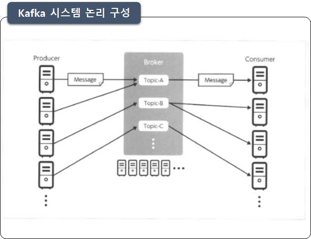

- Broker

  - 데이터를 수신하고 전달하는 서비스

  - 브로커는 데몬 프로세스로 동작

  - 클러스터 구성 가능, 처리량 향상을 위한 스케일아웃

  - 데이터를 디스크로 저장 가능

- Message

  - 카프카에서 다루는 데이터의 최소 단위. 

  - 카프카가 중계하는 로그의 한줄 한줄과 센서 데이터 등이 이에 해당 

  - 메시지는 Key와 Value 형태로 구성

- Producer
  - 데이터의 생산자이며 브로커에 메시지를 보내는 애플리케이션

- Consumer
  - 브로커에서 메시지를 취득하는 애플리케이션

- Topic

  - 메시지를 종류(토픽)별로 관리하는 스토리지 

  - 브로커에 배치되어 관리

  - 프로듀서와 컨슈머는 특정 토픽을 지정하여 메시지를 송수신함

  - 단일 카프카 클러스터에서 여러 종류의 메시지를 중계

## 2) Broker

프로듀서 컨슈머 사이에 존재하는 브로커

### 브로커 존재여부 비교

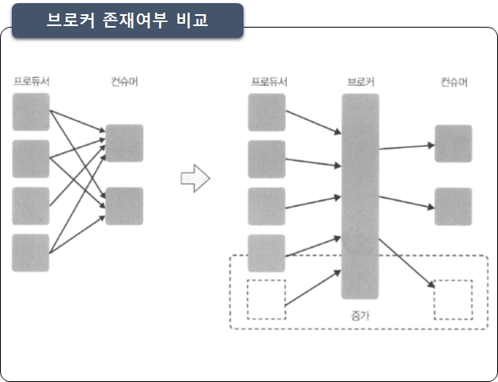

- 프로듀서/컨슈머 접속처를 하나로 통일

  - 프로듀서는 수신처를 고민할 필요없이 전송에만 집중

  - 컨슈머는 송신처 고민없이 수신에만 집중

  - 그러므로 브로커의 존재는 시스템 구성을 단순하게 함

- 프로듀서/컨슈머 증감에 대한 유연한 대처

  - 프로듀서/컨슈머 모두 서로의 존재를 몰라도 되므로 서로의 증감에 유연한 대응이 가능

  - 프로듀서/컨슈머 접속 관계에 변경이 생겨도 기존 프로듀서/컨슈머는 영향 받지 않음

  - 접속 시작을 위한 구현 부하가 낮음

  - 기존 환경에 영향을 주지 않음

  - 그러므로 이러한 변경에 강함

### Kafka 브로커

* 실행된 카프카 어플리케이션 서버들을 브로커라고 함
* 보통 3대 이상의 브로커로 클러스터 구성
  * 1대 또는 2대로 구성 가능하지만 복제본의 효율을 고려하여 3대 이상으로 구성한다.(짝수/홀수개는 중요하지 않음)
* N개 브로커중 1대가 컨트롤러(Controller) 기능을 수행함
  * 브로커 컨트롤러
    * 각 프로커에게 파티션을 할당하는 작업 수행
    * 브로커 정상 동작 모니터링 관리
    * 어떤 브로커가 컨트롤러인지는 주키퍼에 저장

- 주키퍼와 연동
  - 주키퍼 의 역할은 브로커들의 메타데이터(브로커ID, 컨트롤러ID 등)을 저장한다.
  - kafka ver 3.x 부터는 주키퍼 없이 브로커에서 메타데이터를 직접관리 할 수 있다.
    - kafka 구성의 복잡도를 낮추기 위해 주키퍼를 사용하지 않는 방안을 노력하고 있음.

## 3) Partition과 Consumer Group

병렬처리를 가능하게 하는 Partition과 수신 애플리케이션을 담당하는 Consumer Group 

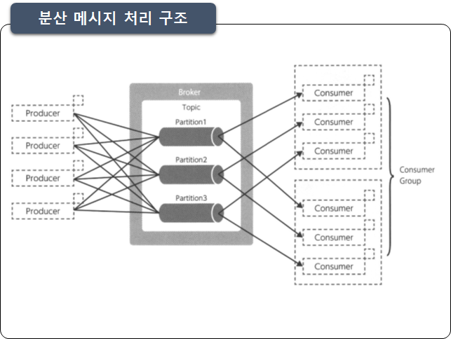

### Partition

- 브로커내에서 데이터를 읽고 쓰는 최소 기준단위

- 메시지 수신, 컨슈머로 배달을 분산함으로 하나의 토픽에 대한 대규모 데이터 수신과 전달을 지원

- 프로듀서API / 컨슈머API가 파티션들을 은폐해서 통신함

- 프로듀서/컨슈머에서는 토픽만을 지정하며 파티션을 의식할 필요가 없음

- partition 내의 데이터들 추가만 가능한 append-only 파일로 저장됨

- 각 메세지를 저장하는 위치를 offset 이라고 함

- 프로듀서가 보낸 메세지는 파티션의 맨 뒤에 추가되며 삭제되지 않음(일정시간 이후 삭제)

### Consumer Group

- 애플리케이션 당 하나의 컨슈머그룹 매핑됨

- 토픽으로 부터 메시지를 취득하는 주체

- 카프카 클러스터 전체에서 컨슈머 그룹을 식별해, 읽어들일 파티션을 분류하고 재시도를 제어

- 파티션당 Offset을 관리하는 기준

## 4) Offset 관리

Conumer Group 단위로 Offset 을 관리

### offset 종류

| **Offset** **종류**     | **설명**                                      |
| ----------------------- | --------------------------------------------- |
| **Log-End-Offset(LEO)** | 파티션 데이터의 끝을 나타냄                   |
| **Current Offset**      | 컨슈머가  어디까지 메시지를 읽었는가를 나타냄 |
| **Commit Offset**       | 컨슈머가  어디까지 커밋했는지를 나타냄        |

### offset 상태변화

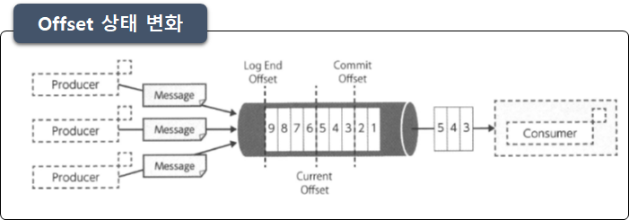

### 용어설명

- Offset

  - 파티션에서 수신한 메시지에는 각각 일련번호가 부여되어 있음

  - Offset은 파티션내에 메시지 위치를 의미함

  - 컨슈머가 취득하는 메시지의 범위 및 재시도를 제어

  - 컨슈머 그룹별로 보관, 관리, 업데이트됨

- LEO(Log-End_Offset)

  - 파티션 데이터의 끝을 나타냄

  - 브로커에 의해 관리되고 업데이트됨

- Current Offset

  - 컨슈머가 메시지를 읽은 위치를 나타냄

  - 컨슈머에서의 데이터 취득으로 업데이트됨

-  Commit Offset 

  - 컨슈머가 커밋한 위치를 나타냄

  - 오프셋 커밋 요청으로 업데이트됨

- Consumer Lag

  - LEO – Currnet Offset 값이 Lag 값이 됨

  - Consumer 성능이 느리거나 장애 발생할 경우 Lag 값이 반드시 증가됨

  - 그러므로 운영모니터링의 중요한 지표로 사용됨

## 5) Consumer Rollback

컨슈머 처리 실패시 롤백처리

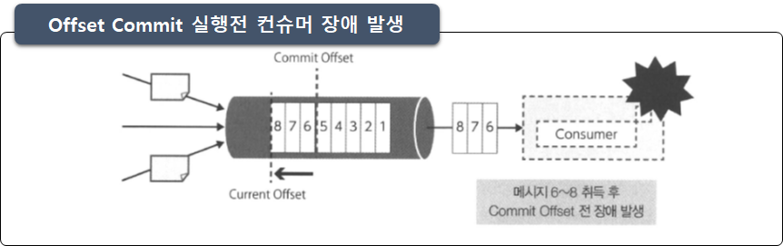

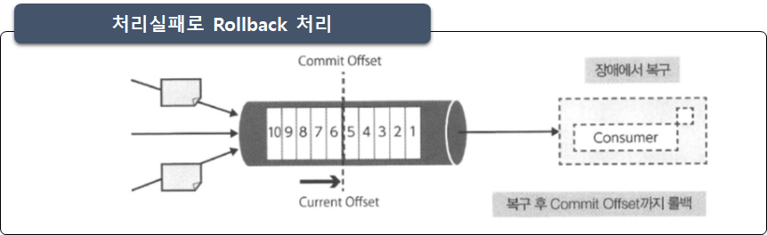

## 6) Producer Partitioning

Producer의 파티션별 메시지 송신하는 방법

### 메시지 송신시 Partitioning 방법

Partitioning 은 Record 가 어떤 Partition에게 전송될 것인지 선택하는 전략

| **전송방법**                | **설명**                                                     |
| --------------------------- | ------------------------------------------------------------ |
| 라운드 로빈 의한 송신       | 메시지 Key를 지정하지 않고 Null 값으로  전송함  메시지를 여러 파티션으로 라운드 로빈 전송 - 분산처리가 되므로 처리 속도빠름 |
| Key의 해시값을  사용한 송신 | Key에  따라 송신처 파티션 결정함(메시지중  Key를 명시함)  동일한 Key를 가진 메시지는 동일한 ID를  가진 파티션에 송신됨 - 순서보증 |
| 파티션 지정 송신            | 송신때  사용할 파티션을 직접 지정                            |

### kafka v2.4 이상 Partitioning

* Producer 의 성능을 높이기 위해서 Sticky Partitioner 기능이 추가됨.

|  **partitioner.class**   | **설명**                                                     |
| :----------------------: | :----------------------------------------------------------- |
|    DefaultPartitioner    | key 가 존재하면 hash 값을 기반으로 선택, key 가 존재하지 않으면 UniformStickyPartitioner 전략으로 구현되어 있음 |
|  RoundRobinPartitioner   | Partition의 순서대로 하나씩 할당한다.                        |
| UniformStickyPartitioner | `batch.size` 가 가득 차거나 `linger.ms`가 경과할 때까지 특정 파티션에 sticky 하게 고정된다.  데이터를 특정 Partition 으로 보내는 기능으로 Producer의 성능을 높일 수 있다. |

### Key 사용시 파티션 편향 주의

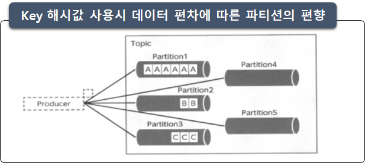

- 데이터 편차에 따른 파티션의 편향에 주의해야 함

- 파티션 수 보다 Key의 종류가 작을때는 특정 파티션에만 집중되는 파티션 편향이 발생함

- 리소스를 부분적으로 사용할 수 없으므로 비효율적임

## 7) Consumer Partitioning

### Consumer의 수 고려

* Consumer의 수는 Partition의 수를 고려하여 생성해야 함

- 1개의  Consumer 일때는 모든 Partition의 데이터를 단일 프로세스로 처리함
- 다수개의 Consumer 일때 담당하는 Partition을 분할하여 병렬처리가 가능함

### Consumer가 Partition 보다 적을때

특정 Consumer 에 부하가 집중 될 수 있음

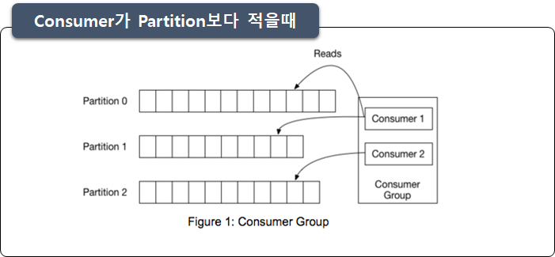

### Consumer가 Partition 보다 많을때

특정 Consumer가 idle 상태로 유지 되며 어떤 메세지도 수신 받지 못함

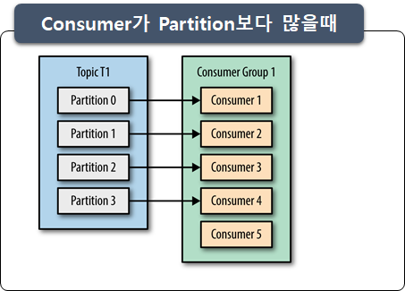

# 3. Kafka Replication

## 1) Replication

카프카는 브로커 장애시 수신 메시지 분실 방지를 위한 복제(Replication) 구조가 존재함

### Replication

- Replication은 parition의 고가용성을 위해 사용됨

- 토픽 단위로 Replica 수를 지정

- 파티션은 단일 또는 여러 개의 Replica로 구성

- Replica중 하나는 Leader, 나머지는 Follower라고 불림

- Follower는 Leader로부터 메시지를 취득하여 복제 유지

- 프로듀서/컨슈머와의 데이터 교환은 Leader가 담당

- Broker 개수에 따라서 raplica 수가 제한됨
  - Broker 개수가 3이면 replica 수가 4가 될 수 없다.

## 2) ISR

Replication 그룹의 ISR(In-Sync Replica)

### ISR(In-Sync Replica)

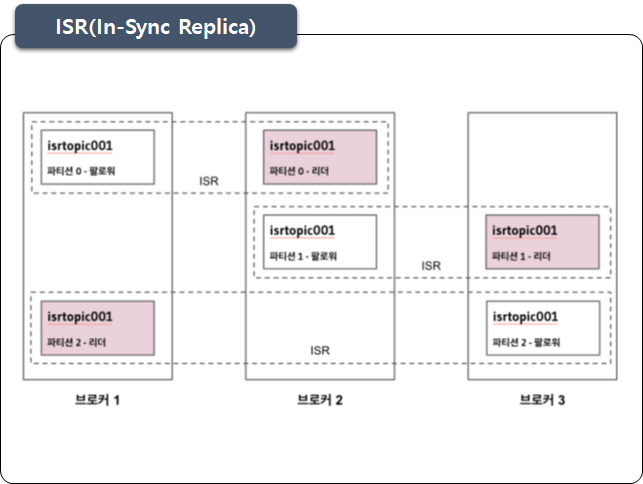

- ISR은 **현재 동기화 상태에 있는** **리플리케이션**을 의미

- ISR그룹내 리더 오류시 팔로워가 리더로 선정됨

- ISR에 속해 있는 팔로워만이 리더의 자격을 가질 수 있음

- ISR그룹의 리더는 팔로워들의 상태를 주기 **(replica.lag.time.max.ms)** 적으로 확인

- 팔로워 상태가 down 이면, 리더는 해당 팔로워를 ISR 그룹에서 추방함

## 3) High Watermark 

복제 완료시점을 기록하는 High Watermark Offset

### High Watermark

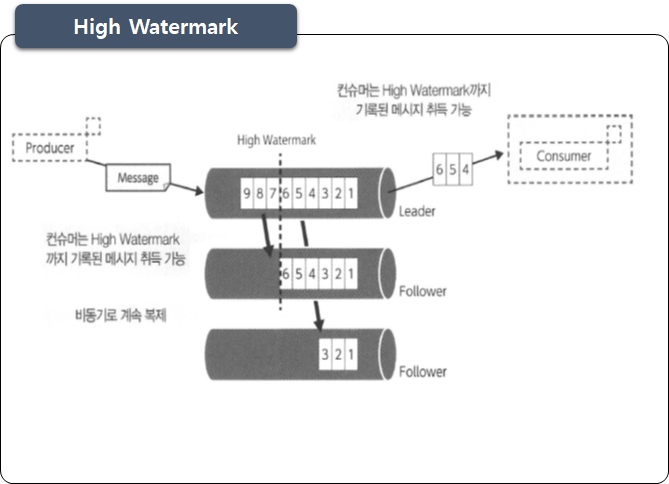

- High Watermark는 복제가 완료된 오프셋

- 그러므로 반드시 LEO(Log End Offset)과 동일하거나 그 보다 이전 오프셋을 기록함 

- 컨슈머는 High Watermark까지 기록된 메시지를 취득할 수 있음

## 4) Producer Ack

Replication 구조에서 Producer 메시지 송신 타이밍을 결정하는 Ack 설정

### Ack 3가지 설정

| **Acks** | **Description**                                              | **Message Loss** | Speed  |
| -------- | ------------------------------------------------------------ | ---------------- | ------ |
| 0        | Producer는 서버로 부터 확인을 기다리지 않고 다음 메시지를 송신  소켓 버퍼에 추가되고 전송 된 것으로 간주 | High             | High   |
| 1        | Producer는 자신이 보낸 메시지에 대해 서버의 leader가 받았는지 기다림  이때 follower들은  확인하지 않음  leader가 ACK을  보낸뒤 follower에게 복제되기 전에 실패하면 해당 메시지는 손실될 수 있음 | Medium           | Medium |
| ALL(-1)  | ISR 그룹내 모든 복제가 완료되면 Ack를 반환하는 구조  Producer는 자신이 보낸 메시지에 대해 서버의 leader  가  전체 동기화 된 follower들이 받았는지 승인할때 까지  기다림  최소 하나의 복제본까지  처리됨을 확인하므로 메시지 손실의 확률은 거의 없음 | Low              | Low    |

### Acks 설정

- Default는 acks=1

- Acks = all 인 경우 'min.insync.replicas' 옵션을 설정하여 leader가 전파할 follower 수를 지정가능

- min.insync.replicas 옵션은 메시지를 보낼 때 write를 성공하기 위한 최소 복제본의 수를 의미하며 default = 1 임

## 5) Ack와 min.insync.replicas 관계

Ack=all 일때의 min.insync.replicas 값의 관계

### min.insync.replicas가 Replicas와 동일한 경우

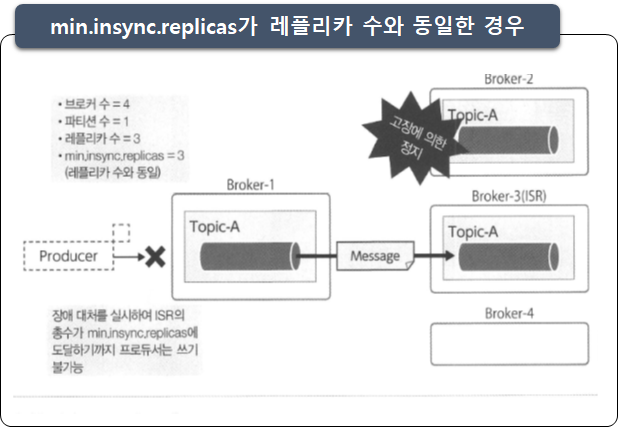

- 브로커 서버가 1대라도 장애시 프로듀서는 데이터 전송 불가

- 문제의 레플리카가 ISR로 복귀시 데이터 전송가능

### min.insync.replicas가 Replicas보다 작을 경우

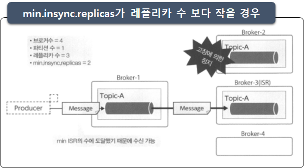

- 브로커 서버가 1대 장애시에도 Ack를 반환하고 진행가능

- 복구 전 2대 장애시 처리 중인 메시지 손실 위험 높음

### Ack=all에서의 min.Insync.replicas 설정의 의미

- 값이 높아지면 유실가능성은 낮아지는 대신 속도 저하됨

- 값이 낮아지면 속도는 향상되지만 유실가능성이 높아짐

- 데이터 유실 방지 수준과 카프카 시스템의 처리속도 사이의 균형을 조정함

- 요구사항과 제약조건에 의해 결정되어야 함

