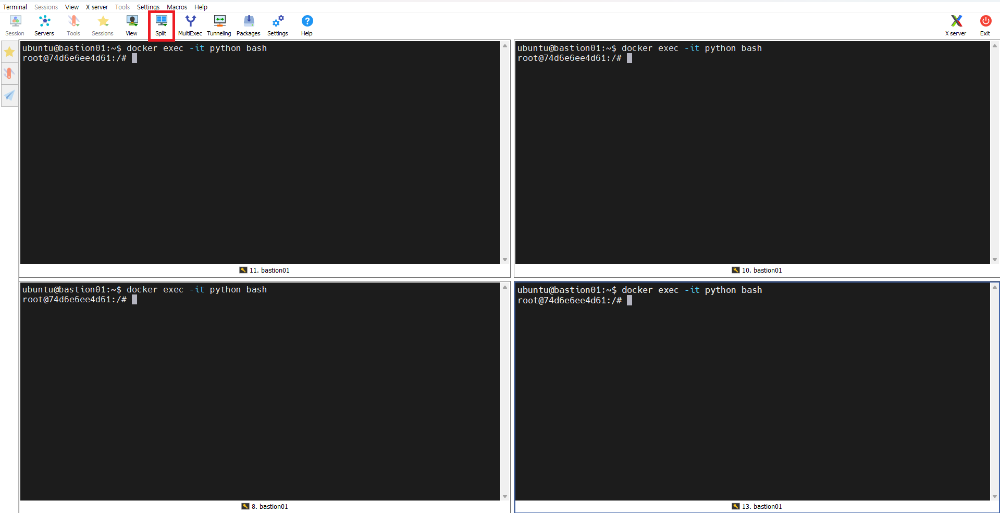
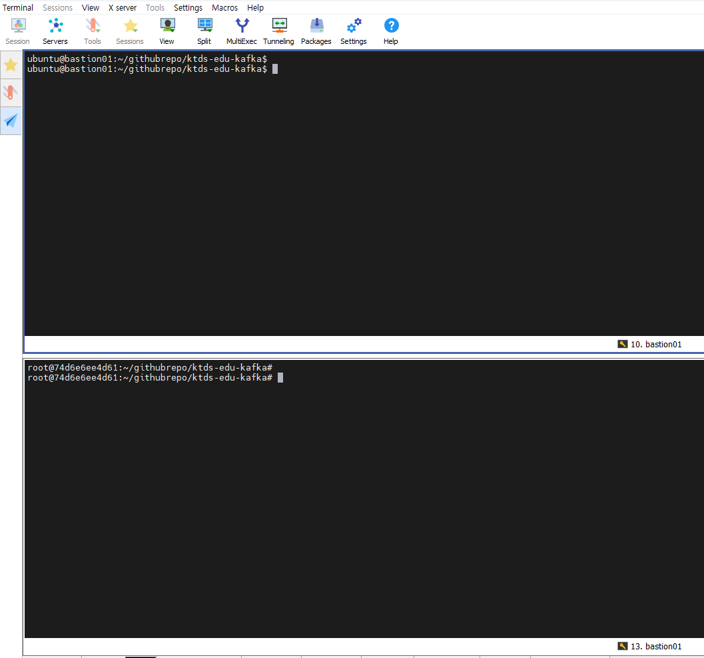

# Kafka Hands-in 2

>Kafka On Kubernetes


# 1. 테스트 환경 준비


## 1) Bastion server


### Cluster 위치 변경

env 파일에서 localcluster는 주석처리하고 ktdseducluster를 연결시킨다.

```sh
# ubuntu terminal 에서


$ vi ~/env
...
export KUBECONFIG=~/.kube/config-ktdseducluster    # <-- 주석해지
#export KUBECONFIG=~/.kube/config-localcluster     # <-- 주석처리

# 저장후 종료


### 반드시 exit 후 terminal 재접속 할것 ###
$ exit


# 재접속후
# 확인
$ cat ~/env
...
export KUBECONFIG=~/.kube/config-ktdseducluster
#export KUBECONFIG=~/.kube/config-localcluster

# ktdseducluster 로 연결여부 확인
$ kubectl get nodes
NAME          STATUS   ROLES                       AGE    VERSION
master01.c1   Ready    control-plane,etcd,master   7d9h   v1.28.6+k3s2
master02.c1   Ready    control-plane,etcd,master   7d9h   v1.28.6+k3s2
master03.c1   Ready    control-plane,etcd,master   7d9h   v1.28.6+k3s2
worker01      Ready    <none>                      31h    v1.28.6+k3s2
worker02      Ready    <none>                      31h    v1.28.6+k3s2
worker03      Ready    <none>                      31h    v1.28.6+k3s2


# 위와 같이 6개 node 가 보인다면 성공
```


## 2) Python Container 준비

이전에 python Docker Container 으로 실습했던 자료를 참고하여 테스트 수행한다.


### [참고] Python Docker Container - ★★★

```sh
# bastion Server 에서
## docker 실행이 안되었을 경우만 ....
$ docker run --name python --user root -d python:3.9 sleep 365d


# python 확인
$ docker ps -a
CONTAINER ID  IMAGE                         COMMAND     CREATED        STATUS            PORTS       NAMES
fb231e23f9f1  docker.io/library/python:3.9  sleep 365d  2 seconds ago  Up 2 seconds ago              python


# 1) python Container 내부로 진입( bash 명령 수행)
$ docker exec -it python bash
root@a225dc4c3dd7:/#           <-- 이런 prompt 가 표기 되어야 정상

# 2) 관련 library 설치
# python Conatiner 내부에서
$ pip install kafka-python

```


### Python 실습자료 download

python Conatiner에서 실습 자료를 download 하자.

```sh
# 1) 실습자료 download
# python Conatiner 내부에서
$ mkdir -p ~/githubrepo
  cd ~/githubrepo

$ git clone https://github.com/ssongman/ktds-edu-kafka.git

$ cd ~/githubrepo/ktds-edu-kafka

# 필요한경우 pull 을 다시 받는다.
$ git pull


```


### library & tool 설치

python Conatiner에서 실습 자료를 download 하자.

```sh
# python Conatiner 내부에서

# 1) 관련 library 설치
$ pip install configparser


# 2) vim 설치
$ apt update
$ apt install vim -y

```


# 2. Rebalancing Round

 일반적으로 Consumer group의 멤버 구성에 변화가 생기면 리소스의 재분배가 필요한데 이를 **Rebalancing Round** 라고 한다.

이 Rebalancing Round가 발생하는 동안은 어떤 컨슈머들도 정상적인 데이터 처리를 하지 못한다는 문제를 가지는데 카프카에서는 이를 **Stop The World** 라는 용어로 부른다. 

이는 수천 개의 Connect Task 가 그룹에 존재했을 때 그 수천 개의 프로세스가 전부 정상 동작하지 못하게 되는 상황을 맞이한다. 

이런 Rebalancing 과 관련된 Stop The World 는 일반적인 하드웨어나 네트워크 손실 문제로 발생한 일시적인 client fail 과 더불어, scale up / down 의 상황이나 계획적인 클라이언트 start / stop / restart 의 상황에서 전부 발생할 수 있다. 

그럼 Consumer 갯수에 따른 Partition 매핑 관계와 Consumer Rebalancing 현상에 대해서 확인해 보자.


## 1) Rebalancing 시나리오

### (1) 설명 

- Partition 3개인 Topic 에서 Consumer 갯수 변화에 따른 partition assigned 현황 관찰

### (2) Consumer 환경 

- Consumer1:  Spring boot

- Consumer2:  python [Container]
- Consumer3:  python [Container]
- Consumer4:  python [Container]

### (3) Producer 환경 

- 한개의 python producer 에서 1초에 한번씩 전송

### (4) topic 환경

* topic : edu-topic13
* group-id : edu-topic13-cg


## 2) 테스트 수행 

bastion Server Terminal 4개를 준비한다.  Mobaxterm Split 기능을 이용하면 4개의 terminal을 한꺼번에 볼수 있으니 참고하자.

4개의 모든 Termminal 에서는 docker 로 python container 로 진입한다.




### (1) step1 :  Spring boot  - Consumer

- edu-topic__ / edu-group__ 셋팅후 실행

- Spring boot 로 Consumer 실행한다.

- Spring boot log 를 확인한다.

- 예상결과 : partition 1,2,3 이 모두 한꺼번에 assigned 될 것이다.

  ```
  edu-topic13-cg: partitions assigned: [edu-topic13-0, edu-topic13-1, edu-topic13-2]
  ```

  

### (2) step2 :  python  - Consumer1 실행

- Bastion Server Terminal 1번 접속

- python  Consumer 실행한다.

  - ```sh
    
    $ cd ~/githubrepo/ktds-edu-kafka/kafka/PythonSample
    
    # 자신의 topic 명을 아규먼트로 입력한다.
    # args : topic-name, group-id
    $ python 11.consumer.py edu-topic13 edu-topic13-cg
    
    ```


- Spring boot log 를 확인한다.

- 예상결과 : partition 1,2,3 중 하나가 제외 처리 될 것이다.

  ```
  edu-topic13-cg: partitions assigned: [edu-topic13-0, edu-topic13-1]
  ```


### (3) step3 :  python  - Consumer2 실행

- Bastion Server Terminal 2번 접속

- python  Consumer 실행한다.

  - ```sh
    
    $ cd ~/githubrepo/ktds-edu-kafka/kafka/PythonSample
    
    # 자신의 topic 명을 아규먼트로 입력한다.
    # args : topic-name, group-id
    $ python 11.consumer.py edu-topic13 edu-topic13-cg
    ```

    

- Spring boot log 를 확인한다.

- 예상결과 : partition 1,2,3 중 두개가 제외 처리 될 것이다.

  ```
  edu-topic13-cg: partitions assigned: [edu-topic13-0]
  ```


### (4) step4 :  python  - Consumer3 실행

- Bastion Server Terminal 3번 접속

- python  Consumer 실행한다.

  - ```sh
    
    $ cd ~/githubrepo/ktds-edu-kafka/kafka/PythonSample
    
    # 자신의 topic 명을 아규먼트로 입력한다.
    # args : topic-name, group-id
    $ python 11.consumer.py edu-topic13 edu-topic13-cg
    ```

    

- Spring boot log 를 확인한다.

- 예상결과 : 변화사항이 없다. - assigned 될 partition 이 없어서 Consumer 가 낭비되는 상황이다.


### (5) step5 :  python  - Producer 실행

- Bastion Server Terminal 4번 접속

- python producer 초당 1회 발송

  - ```sh
    
    $ cd ~/githubrepo/ktds-edu-kafka/kafka/PythonSample
    
    # 자신의 topic 명을 아규먼트로 입력한다.
    # args : topic-name
    $ python 12.producer.py edu-topic13
    
    ```

    

- Grafana, kafdrop 확인

- 각각 Consumer log 를 확인한다.

- 예상결과

  - 3개의 Consumer 에서 각각 로그가 균등하게 출력될 것이다. 
  - assigned 되지 못한 python-consumer3 은 변화가 없을 것이다.


### (6) step6 :  python  - Consumer 삭제

- producer 초당 1회 발송을 유지하며 ...
- python Consumer 3번을 제거한다. ( Ctrl+C  )
- [stop the world확인] 각각 Consumer log 를 확인한다. 
- python Consumer 2번을 제거 ( Ctrl+C  )
- [stop the world확인] 각각 Consumer log 를 확인한다. 
- python Consumer 1번을 제거 ( Ctrl+C  )
- [stop the world확인] 각각 Consumer log 를 확인한다. 

 

### (7) [참고] Clean up

```sh
# python 종료
#  Ctrl+C 로 python 종료

# Bastions Server Container 종료
$ docker ps -a

$ docker -rf python


# STS 실행종료
Stop 버튼으로 종료처리 수행

```


## 3) Trouble Shooting

### (1) 지속적인 Rebalancing 현상

#### 현상

Rebalancing 이 반복해서 발생하면서 처리가 멈추는 현상이 발생


#### 분석 - Rebalancing 발생하는 현상

Consumer 의 갯수가 변경 되는 경우 외에도 아래와 같은 경우가 발생할 수 있다.

* session.timeout.ms 설정시간(기본10초)에 heartbeat 시그널을 받지 못해 리밸런스가 발생하는 경우

* max.poll.interval.ms 설정시간(기본5분)에 poll() 메소드가 호출되지 않아 리밸런스가 발생하는 경우


#### 주요 컨슈머 옵션

| 옵션명                    | 설명                                                         | 기본값       |
| :------------------------ | :----------------------------------------------------------- | :----------- |
| `session.timeout.ms`      | 컨슈머와 브로커사이의 session timeout 시간. 컨슈머가 살아있는것으로 판단하는 시간으로 **이 시간이 지나면 해당 컨슈머는 종료되거나 장애가 발생한것으로 판단하고 컨슈머 그룹은 리밸런스를 시도한다.** 이 옵션은 heartbeat 없이 얼마나 오랫동안 컨슈머가 있을 수 있는지를 제어하며 heartbeat.interval.ms와 밀접한 관련이 있어서 일반적으로 두 속성이 함께 수정된다. | 10000 (10초) |
| `heartbeat.interval.ms`   | 컨슈머가 얼마나 자주 heartbeat을 보낼지 조정한다. session.timeout.ms보다 작아야 하며 일반적으로 1/3로 설정 | 3000 (3초)   |
| `max.poll.interval.ms`    | 컨슈머가 polling하고 commit 할때까지의 대기시간. 컨슈머가 살아있는지를 체크하기 위해 hearbeat를 주기적으로 보내는데, 계속해서 heartbeat만 보내고 실제로 메시지를 가져가지 않는 경우가 있을 수 있다. 이러한 경우에 컨슈머가 무한정 해당 파티션을 점유할 수 없도록 **주기적으로 poll을 호출하지 않으면 장애라고 판단하고 컨슈머 그룹에서 제외**시키도록 하는 옵션이다. | 300000 (5분) |
| `max.poll.records`        | 컨슈머가 최대로 가져 갈 수있는 갯수. 이 옵션으로 polling loop에서 데이터 양을 조정 할 수 있다. | 500          |
| `enable.auto.commit`      | 백그라운드로 주기적으로 offset을 commit                      | true         |
| `auto.commit.interval.ms` | 주기적으로 offset을 커밋하는 시간                            | 5000 (5초)   |
| `auto.offset.reset`       | earliest: 가장 초기의 offset값으로 설정 latest: 가장 마지막의 offset값으로 설정 none: 이전 offset값을 찾지 못하면 error 발생 | latest       |

[더 많은 컨슈머 옵션보기](https://kafka.apache.org/documentation/#consumerconfigs)


컨슈머는 메시지를 가져오기위해 브로커에 poll()요청을 보내고, 컨슈머는 가져온 메시지를 처리한 후, 해당 파티션의 offset을 커밋하게 된다.

poll요청을 보내고 다음 poll을 요청을 보내는데 까지의 시간이 max.poll.interval.ms의 기본값인 300000 (5분) 보다 늦으면 브로커는 컨슈머에 문제가 있다고 판단하여 리밸런싱을 일으키게 된다.

*max.poll.interval.ms 기본값 : 300000(5분)*
*max.poll.records 기본값 : 500*


그러므로 해결방안은 아래와 같이 두가지가 있을 수 있다.

1) 500개  처리하는데 소요되는 적정 시간을 늘린다.(ex, max.poll.interval.ms=600000 (10분))
2) 한번에 처리되는 poll 갯수를 줄인다. (ex,  max.poll.records=100 으로 조정)


#### [참고] java max.poll.interval.ms 조정 처리 예제

```java
public class ChangeKafkaListener
{	
	@KafkaListener( topics       = "my-topic"
				  , groupId      = "my-topic-group"
				  , errorHandler = "changeKafkaListenerErrorHandler"
				  , properties   = {"max.poll.interval.ms=108000000"} ) // 300000:5분, 108000000: 30분
	public void onMessage(String msg)
	{
		...
    }
```


# 3.  Producer 관련 실습


## 1) key 와 partition 관계 이해

- key 존재여부에 따라서 데이터가 어떻게 흘러가는지 확인해 보자.
- 기본적으로 kafka는 key가 설정되지 않은경우, 메시지는 reound robin 방식으로 파티션을 선택하여 메시지가 전달된다.

- key가 있다면 key값을 hashing하고 해싱 결과를 이용하여 파티션을 선택하도록 하고 있다.
- 만약 특정 메시지의 키에 따라 들어온 순서가 중요한 서비스라면, 키를 반드시 할당하고, 이들이 특정 파티션으로 분배되도록 지정해주는 용도로 사용할 수 있다.


### (1) 실습 환경


bastion 터미널 2개를 준비하자.

위는 ubuntu termnial, 아래는 python docker container terminal 이다.




* topic : edu-topic13-a
  * partitions: 1
  * replicas: 1


### (2) key 가 없는 경우 테스트

#### 테스트용 topic 생성

파티션 1개 topic 을 생성한다.

```sh
# ubuntu terminal 에서

$ cd ~/githubrepo/ktds-edu-kafka

$ cat ./kafka/strimzi/topic/12.kafka-edu-topic-a.yaml

apiVersion: kafka.strimzi.io/v1beta2
kind: KafkaTopic
metadata:
  name: edu-topic13-a
  labels:
    strimzi.io/cluster: my-cluster
  namespace: kafka
spec:
  partitions: 1
  replicas: 1
  config:
    retention.ms: 7200000      # 2 hour


# 본인의 topic 명으로 변경한다.
# 예를들면 
# edu-topic13-a --> edu-topic02-a
$ vi ./kafka/strimzi/topic/12.kafka-edu-topic-a.yaml
...


# 확인
$ cat ./kafka/strimzi/topic/12.kafka-edu-topic-a.yaml
...

# topic 생성
$ kubectl -n kafka apply -f ./kafka/strimzi/topic/12.kafka-edu-topic-a.yaml


# 확인
$ kubectl -n kafka get kafkatopic
NAME            CLUSTER      PARTITIONS   REPLICATION FACTOR   READY
edu-topic13     my-cluster   3            2                    True
edu-topic13-a   my-cluster   1            1                    True
edu-topic02     my-cluster   3            2                    True
edu-topic03     my-cluster   3            2                    True
...

```


#### kafdrop 확인

http://kafdrop.kafka.43.203.62.69.nip.io/


#### 한번씩 10개 send

```sh
# python Container 에서

$ cd ~/githubrepo/ktds-edu-kafka/kafka/PythonSample

$ cat 21.producer-10pub.py

# 10 회전송
$ python 21.producer-10pub.py edu-topic13-a

```


### (3) partition 추가

#### topic에 partition 추가

파티션 2개 로 수정한다.

```sh
# ubuntu terminal 에서

# topic partition 수정
$ kubectl -n kafka edit kafkatopic edu-topic13-a

apiVersion: kafka.strimzi.io/v1beta2
kind: KafkaTopic
metadata:
  name: edu-topic13-a
  labels:
    strimzi.io/cluster: my-cluster
  namespace: kafka
spec:
  partitions: 2               # <--- 2로 수정한다.
  replicas: 1
...

# 저장후 종료 : vi 명령어와 동일


# 확인
$ kubectl -n kafka get kafkatopic edu-topic13-a
NAME            CLUSTER      PARTITIONS   REPLICATION FACTOR   READY
edu-topic13-a   my-cluster   2            1                    True  # <-- 변경되었음
...

```


#### kafdrop 확인

http://kafdrop.kafka.43.203.62.69.nip.io/


#### 한번씩 10개 send

```sh
# python Container 에서

$ cd ~/githubrepo/ktds-edu-kafka/kafka/PythonSample

# 10 회전송
$ python 21.producer-10pub.py edu-topic13-a

```


#### 확인

kafdrop을 통해서 확인해보자.

2개 파티션에 균등하게 RR방식으로 분산되어 있다.


### (4) key 지정

key가 존재하는 데이터를 토픽에 보낸다면 어떻게 될까?

key가 존재할 경우 kafka 는 key 를 특정한 hash 값으로 변형시켜서 파티션과 1대1 매칭을 시킨다.

그러므로 각 파티션에 동일한 key  값만 쌓이게 된다.

kafka 메시지에 key를 할당하고, 이 key에 따라 파티션이 선택되도록 해보자.

```sh
# python Container 에서

$ cd ~/githubrepo/ktds-edu-kafka/kafka/PythonSample

# 소스 확인
$ cat 22.producer-10pub_key.py


# key할당하여 메세지 송신 - key는 아규먼트로 입력
$ python 22.producer-10pub_key.py edu-topic13-a key1


# kafdrop 을 확인하면서 다시 한번 보내보자.

# 한번더 송신
$ python 22.producer-10pub_key.py edu-topic13-a key1

```


#### 확인

kafdrop을 통해서 확인해 보면 특정 파티션 1개에만 보내지는 것을 확인 할 수 있다.


다른 이름의 key 로 보내보자. 

```sh
# python Container 에서
$ cd ~/githubrepo/ktds-edu-kafka/kafka/PythonSample

# key명을 아규먼트로 입력
$ python 22.producer-10pub_key.py edu-topic13-a key2
$ python 22.producer-10pub_key.py edu-topic13-a key3

```


### (5) key사용후 partition 추가

partition 을 한개 더 추가 할경우 어떻게 될까?

토픽에 partition 을 추가하는 순간 그 동안 매핑되었던 key와 partition 의 일관성은 보장되지 않는다.

그러므로 key 를 사용할 경우  추후 생성하지 않는 것을 권장한다.


#### topic에 partition 추가

파티션 3개 로 수정한다.

```sh
# ubuntu terminal 에서


# topic partition 수정
$ kubectl -n kafka edit kafkatopic edu-topic13-a

apiVersion: kafka.strimzi.io/v1beta2
kind: KafkaTopic
metadata:
  name: edu-topic13-a
  labels:
    strimzi.io/cluster: my-cluster
  namespace: kafka
spec:
  partitions: 3               # 2 --> 3 으로 수정한다.
  replicas: 1
...

# 저장후 종료 : vi 명령어와 동일


# 확인
$ kubectl -n kafka get kafkatopic edu-topic13-a
NAME            CLUSTER      PARTITIONS   REPLICATION FACTOR   READY
edu-topic13-a   my-cluster   3            1                    True  # <-- 변경되었음
...

```

kafdrop을 통해서 확인해보면 partition 이 변경된 것을 확인할 수 있다.


#### data send

```sh
# python Container 에서
$ cd ~/githubrepo/ktds-edu-kafka/kafka/PythonSample

# key명을 아규먼트로 입력
$ python 22.producer-10pub_key.py edu-topic13-a key1
$ python 22.producer-10pub_key.py edu-topic13-a key2
$ python 22.producer-10pub_key.py edu-topic13-a key3


```


#### 확인

토픽에 파티션을 추가하는 순간 이전에 매핑되었던 key와 partition의 일관성은 보장되지 않는다.

그러므로 key 를 사용할 경우  partition 생성하지 않는 것을 고려하거나 이런 사실에 맞도록 설계해야 할 것이다.


## 2) 전송보장과 ack 

ack 값에 따라서 속도와 데이터 신뢰성이 달라지는 부분이 있다.

얼마만큼 속도가 차이나는지 확인해보자.


### (1) 기본정보

* ack = 0
  * 서버 응답을 기다리지않음
  * 전송 보장도 zero
* ack = 1
  * 파티션의 리더에 저장되면 응답 받음
  * 리더 장애시 메시지 유실 가능
* ack = all(-1)
  * 모든 리플리카에 저장되면 응답 받음
    * 브로커 min.insync.replicas 설정에 따라 달라짐


### (2) 실습환경

python docker container terminal 을 준비하자.

* topic : edu-topic13-b
  * partitions: 3
  * replicas: 3


### (3) 실습

#### 테스트용 topic 생성

```sh
# ubuntu terminal 에서

$ cd ~/githubrepo/ktds-edu-kafka

$ cat ./kafka/strimzi/topic/13.kafka-edu-topic-b.yaml
apiVersion: kafka.strimzi.io/v1beta2
kind: KafkaTopic
metadata:
  name: edu-topic13-b
  labels:
    strimzi.io/cluster: my-cluster
  namespace: kafka
spec:
  partitions: 3
  replicas: 3
  config:
    retention.ms: 7200000      # 2 hour


# 본인의 topic 명으로 변경한다.
# 예를들면 
# edu-topic13-b --> edu-topic02-b
$ vi ./kafka/strimzi/topic/13.kafka-edu-topic-b.yaml
...


# topic 생성
$ kubectl -n kafka apply -f ./kafka/strimzi/topic/13.kafka-edu-topic-b.yaml


# 확인
$ kubectl -n kafka get kafkatopic
NAME            CLUSTER      PARTITIONS   REPLICATION FACTOR   READY
edu-topic13     my-cluster   3            2                    True
edu-topic13-a   my-cluster   3            1                    True
edu-topic13-b   my-cluster   3            3                    True
...

```


#### producer 수행

대량의 데이터(50,000건 정도) 전송하는 테스트를 수행하면서 처리속도를 보자.

```sh
# python Container 에서
$ cd ~/githubrepo/ktds-edu-kafka/kafka/PythonSample

# 소스 확인
$ cat 25.producer-spt-ack.py
...

# 3개의 ack 값을 아규먼트로 수행해 보자.
# args : topicname, range, ack
$ python 25.producer-spt-ack.py edu-topic13-b 50000 0
$ python 25.producer-spt-ack.py edu-topic13-b 50000 1
$ python 25.producer-spt-ack.py edu-topic13-b 50000 all


# 로그를 확인해보자.
topicName[edu-topic13-b] range_cnt[50000] ack[0] Producing...
duration time : 4.446583032608032

topicName[edu-topic13-b] range_cnt[50000] ack[1] Producing...
duration time : 4.506533145904541

topicName[edu-topic13-b] range_cnt[50000] ack[all] Producing...
duration time : 4.885076284408569

```


#### 확인

ack=all 이 가장 느리다는 것을 알 수 있다.


## 3) Sender 동작

### (1) 기본동작


### (2) 실습환경

python docker container terminal 을 준비하자.

* topic : edu-topic13-b
  * partitions: 3
  * replicas: 3


### (2) batch.size linger.ms 에 따른 메세지 전송차이


* batch.size
  * **Batch size**는 같은 파티션으로 보내는 여러 데이터를 함께 배치로 보내기 위해 양을 조절하는 옵션이다.
  * Batch size 만큼 다 차면 바로 전송한다.
  * 이 값을 증가시키면 한번에 많은 양을 보내며, 전송 횟수도 줄어들어 서버 부하를 감소시킬 수 있다.
  * 사이즈가 너무 작으면 한번에 보낼 수 있는 메시지의 건수가 줄고 처리량이 떨어진다.
  * 기본값: 16K (16,384 byte)
  
* linger.ms
  * 전송대기시간(기본값 0)
  *  batch.size가 꽉 찰 수 있도록 시간을 설정하면 Throughput 최적화에 도움이 된다.
  * 대기시간이 없으면 배치가 덜 차도 브로커로 바로 전송한다.
  * 대기시간을 주면 그 시간 만큼 배치에 메시지 추가가 가능해서 한번의 전송 요청에 더 많은 데이터 처리가능 - 그러므로 처리량이 높아진다.


#### 참고소스

```python

    producer = KafkaProducer(bootstrap_servers=bootstrap_servers,
                             ...
                            batch_size=batchSize,
                            linger_ms=linger_ms)

```


#### producer 수행

```sh
# python Container 에서

$ cd ~/githubrepo/ktds-edu-kafka/kafka/PythonSample

# 소스 확인
$ cat 30.producer-spt-batch-linger.py
...

# batch size 를 변경해 보면서 수행해 보자.
# args : topic, range, batch, linger
$ python 30.producer-spt-batch-linger.py edu-topic13-b 50000 16384 3000
$ python 30.producer-spt-batch-linger.py edu-topic13-b 50000 32768 3000
$ python 30.producer-spt-batch-linger.py edu-topic13-b 50000 65536 3000


# 로그를 확인해보자.
topicName[edu-topic13-b] range_cnt[50000] batch_size[16384] linger_ms[3000] Producing...
duration time : 4.992011070251465

topicName[edu-topic13-b] range_cnt[50000] batch_size[32768] linger_ms[3000] Producing...
duration time : 4.646012544631958

topicName[edu-topic13-b] range_cnt[50000] batch_size[65536] linger_ms[3000] Producing...
duration time : 4.373039722442627

```


#### 확인

batch size가 높아질수록 전송속도가 빨라지는 것을 알 수 있다.


# 4. Consumer 실습


## 1)  auto.offset.reset

Consumer Group 을 처음으로 접속을 시도할때 Topic 의 데이터를 가져오기 위한 옵션이다.


### (1) 기본정보

* auto_offset_reset=latest
  * 가장 마지막 offset 부터 (기본값)

* auto_offset_reset=earliest
  * 가장 처음 offset 부터 가져온다.


### (2) 실습환경

python docker container terminal 을 준비하자.

* topic : edu-topic13-a
* group-id   - 이전에 사용하지 않은 새로운 consumer group 필요
  * edu-topic13-a1-cg
  * edu-topic13-a2-cg


### (3) 실습

#### consumer 수행(latest)

```sh
# python Container 에서
$ cd ~/githubrepo/ktds-edu-kafka/kafka/PythonSample

# 소스 확인
$ cat 41.consumer-offset-reset.py
...

# consumer 수행해 보자.
# args : topic, group-id, auto_offset_reset
$ python 41.consumer-offset-reset.py edu-topic13-a edu-topic13-a1-cg latest


# 로그를 확인해보자.
KafkaConsumer topicName[edu-topic13-a] group_id[edu-topic13-a1-cg] auto_offset_reset[latest]  ...
Consuming...


# 새로운 group-id 로 읽기를 시도했는데 읽어 들이는 데이터가 없다.
```


#### consumer 수행(earliest)

```sh

$ python 41.consumer-offset-reset.py edu-topic13-a edu-topic13-a2-cg earliest

# 로그를 확인해보자.
KafkaConsumer topicName[edu-topic13-a] group_id[edu-topic13-a2-cg] auto_offset_reset[earliest]  ...
Consuming...

...
topic=edu-topic13-a partition=1 offset=19: key=b'key3' value=b'{"eventName":"a","num":6,"title":"a", "writeId":"", "writeName": "", "writeDate":"" }'
topic=edu-topic13-a partition=1 offset=20: key=b'key3' value=b'{"eventName":"a","num":7,"title":"a", "writeId":"", "writeName": "", "writeDate":"" }'
topic=edu-topic13-a partition=1 offset=21: key=b'key3' value=b'{"eventName":"a","num":8,"title":"a", "writeId":"", "writeName": "", "writeDate":"" }'
topic=edu-topic13-a partition=1 offset=22: key=b'key3' value=b'{"eventName":"a","num":9,"title":"a", "writeId":"", "writeName": "", "writeDate":"" }'
...


# 새로운 group-id 로 읽기를 시도후 earliest이므로 모든 데이터를 다 가져온다.
```


#### 확인

earliest 일때는 topic 에서 가지고 있는 모든 data 를 읽어 온다.


### (4) 사용중인 group-id 확인

새로운 group-id 가 아닌 사용중인 group-id로 earliest 수행하면 어떻게 될까?

```sh
$ python 41.consumer-offset-reset.py edu-topic13-a edu-topic13-a1-cg earliest

KafkaConsumer group_id[edu-topic13-a1-cg] auto_offset_reset[earliest]  ...
topicName[edu-topic13-a] subscribed!
Consuming...

# 직전에 한번 사용한 group-id 이므로 읽어들이는 데이터가 없다.
```


#### 확인

edu-topic13-a1-cg 은 이미 사용했으므로 current offset 이 이미 lastest 로 저장되었다.

그러므로 earliest 라도 데이터를 읽지 않는다.


## 2) poll method


### (1) 기본정보

* **max_poll_records**
  * 한번의 call 로 리턴되는 records 의 max 값이다.
  * 기본값 500 
* **max_poll_interval_ms**
  * Consumer group 에서 delay 의 max 값이다.
  * 기본값 300000 (5분)


poll() 함수를 이용해서 consume 했을때 한번에 읽어들이는 건수를 확인해보자.


### (2) 실습환경

python docker container terminal 을 2개 준비하자.


* topic : edu-topic13-b
  * partitions: 3
  * replicas: 3
* group-id : edu-topic13-b-cg


### (3) 실습

#### producer - terminal 1

```sh
# python Container 에서
$ cd ~/githubrepo/ktds-edu-kafka/kafka/PythonSample

# 소스 확인
$ cat 47.producer-spt-ack.py

# 대량 데이터 전송
# args : topic, 발송건수
$ python 47.producer-spt-ack.py edu-topic13-b 50000

KafkaProducer...
topicName[edu-topic13-b] range_cnt[50000] Producing...
duration time : 4.854956150054932


```


#### consumer - terminal 2

```sh
# python Container 에서
$ cd ~/githubrepo/ktds-edu-kafka/kafka/PythonSample

# 소스 확인
$ cat 45.consumer-poll.py
...

# 1) consumer current offset 초기화
# args : topic, group-id, auto_offset_reset
$ python 45.consumer-poll.py edu-topic13-b edu-topic13-b-cg latest
...

TopicPartition(topic='edu-topic13-b', partition=0) 500
TopicPartition(topic='edu-topic13-b', partition=0) 500
TopicPartition(topic='edu-topic13-b', partition=0) 500
TopicPartition(topic='edu-topic13-b', partition=0) 500
TopicPartition(topic='edu-topic13-b', partition=0) 500
TopicPartition(topic='edu-topic13-b', partition=0) 249

```


#### 확인

```sh

# Consumer 로그를 확인해보자.
# 마지막 수치가 records 건수이다.
...
TopicPartition(topic='edu-topic13-b', partition=2) 500
TopicPartition(topic='edu-topic13-b', partition=2) 500
TopicPartition(topic='edu-topic13-b', partition=2) 367
TopicPartition(topic='edu-topic13-b', partition=1) 500
TopicPartition(topic='edu-topic13-b', partition=1) 500
TopicPartition(topic='edu-topic13-b', partition=1) 500
TopicPartition(topic='edu-topic13-b', partition=1) 500
TopicPartition(topic='edu-topic13-b', partition=1) 500
TopicPartition(topic='edu-topic13-b', partition=1) 23
TopicPartition(topic='edu-topic13-b', partition=0) 477
TopicPartition(topic='edu-topic13-b', partition=0) 500
TopicPartition(topic='edu-topic13-b', partition=0) 500
TopicPartition(topic='edu-topic13-b', partition=0) 500
...
```

한번에 읽어 오는 데이터가 500건이 넘지 않는 것을 알수 있다.


Consumer를 유지하면서 producer 수행해보자.


## 3) Auto Commit

Auto commit 은 일정 간격으로 자동 commit 되도록 설정한다.


### (1) 기본정보

```python

    consumer = KafkaConsumer(bootstrap_servers=bootstrap_servers,
                             ...
                             enable_auto_commit=True,        # 기본값: True
                             auto_commit_interval_ms=5000,   # 기본값: 5초
                             group_id=group_id,
                             ...
                             )
```


* 특징

  * enable.auto.commit = true 가 기본 옵션이다.


  * 속도가 빠름

  * 중복 또는 유실이 발생할 수 있음
    * 중복/유실을 허용하지 않는 곳에서는 절대 사용금지


### (2) 실습환경

python docker container terminal 을 2개 준비하자.


* topic : edu-topic13
  * partitions: 3
  * replicas: 2
* group-id : edu-topic13-cg


### (3) 실습

#### consumer - terminal 1

원할한 테스트를 위해서 consumer current offset 을 초기화 한다.(latest로 설정)

```sh
# python Container 에서
$ cd ~/githubrepo/ktds-edu-kafka/kafka/PythonSample

# 소스 확인
$ cat 45.consumer-poll.py
...

# 1) consumer current offset 초기화 (latest로 설정하기 위해서)
# args : topic, group-id, auto_offset_reset
$ python 45.consumer-poll.py edu-topic13 edu-topic13-cg latest

중지...  Ctrl+C
```


#### producer - terminal 2

샘플데이터 10개를 보내 보자.

```sh
# python Container 에서
$ cd ~/githubrepo/ktds-edu-kafka/kafka/PythonSample

# 소스 확인
$ cat 52.producer-10pub.py
...

# 1) 10개 데이터를 보내 보자.
# args : topic, 
$ python 52.producer-10pub.py edu-topic13

```


#### consumer - terminal 1

auto_commit_interval_ms 이 60초로 셋팅된 consumer 로 읽어들이고 바로 종료 후 다시 읽어보자.

```sh
# python Container 에서
$ cd ~/githubrepo/ktds-edu-kafka/kafka/PythonSample

# 소스 확인
$ cat 51.consumer-commit-60s.py
...

# 1) consumer 수행
# args : topic, group-id
$ python 51.consumer-commit-60s.py edu-topic13 edu-topic13-cg

# 10 개 데이터 확인
# commit 되기전에 중지(60초 이전)

#중지...  Ctrl+C


# 2) 한번 더 읽어보자.
$ python 51.consumer-commit-60s.py edu-topic13 edu-topic13-cg

# 10 개 데이터가 또 확인됨

# 중지...  Ctrl+C

```


#### 확인

auto commit 상태에서는 commit 되기전에 consumer 가 중지후 다시 재처리되는 상황이 발생할 수 있다.


## 2) Manual Commit 


### (1) 기본정보

Auto commit 은 일정 간격으로 자동 commit 되도록 설정한다.


```python
    consumer = KafkaConsumer(bootstrap_servers=bootstrap_servers,
                             ...
                             enable_auto_commit=False,
                             # auto_commit_interval_ms=60000,
                             group_id=group_id,
                             ...
                             )
    
    ...
    for message in consumer:
        print("topic=%s partition=%d offset=%d: key=%s value=%s" %
                (message.topic,
                message.partition,
                message.offset,
                message.key,
                message.value))
        consumer.commit()
```


* 특징
  * Consumer Record 처리순서를 보장한다.
  * 속도가 느리다.
  * consumer 가 읽어드린 마지막 offset을 커밋한다.
  * list 를 통해 오프셋 지정 커밋 가능


### (2) 실습환경

python docker container terminal 을 2개 준비하자.

* topic : edu-topic13
  * partitions: 3
  * replicas: 2
* group-id : edu-topic13-cg


### (3) 실습

#### consumer - terminal1

원할한 테스트를 위해서 consumer current offset 을 초기화 한다.(latest로 설정)

```sh
# python Container 에서
$ cd ~/githubrepo/ktds-edu-kafka/kafka/PythonSample

# 소스 확인
$ cat 45.consumer-poll.py
...


# 1) consumer current offset 초기화 (latest로 설정하기 위해서)
# args : topic, group-id, auto_offset_reset
$ python 45.consumer-poll.py edu-topic13 edu-topic13-cg latest

중지...  Ctrl+C
```


#### procucer - terminal2

샘플데이터 10개를 보내 보자.

```sh
# python Container 에서
$ cd ~/githubrepo/ktds-edu-kafka/kafka/PythonSample

# 소스 확인
$ cat 52.producer-10pub.py
...

# 1) 10개 데이터를 보내 보자.
# args : topic
$ python 52.producer-10pub.py edu-topic13 

```


#### consumer - terminal1

auto_commit_interval_ms 이 60초로 셋팅된 consumer 로 읽어들이고 바로 종료 후 다시 읽어보자.

```sh
# python Container 에서
$ cd ~/githubrepo/ktds-edu-kafka/kafka/PythonSample

# 소스 확인
$ cat 55.consumer-mannual-commit.py
...

# 1) consumer current offset 초기화
# args : topic, group-id, auto_offset_reset
$ python 55.consumer-mannual-commit.py edu-topic13 edu-topic13-cg

# 10 개 데이터 확인 
중지...  Ctrl+C


# 2) 한번 더 읽어보자.
$ python 55.consumer-mannual-commit.py edu-topic13 edu-topic13-cg

# 읽어들이는 데이터가 존재하지 않음

중지...  Ctrl+C

```


#### 확인

manual commit 상태에서는 중복 처리 되지 않는다.

하지만 commit() 을 명시해야 해야 하는 불편함이 있으며 속도도 느리다.

이런 매커니즘을 잘 이해하고 설계에 반영해야 한다.


# 5. Clean Up


## 1) topic 삭제

```sh

# ubuntu terminal 에서
$ cd  ~/githubrepo/ktds-edu-kafka


# topic 삭제
$ kubectl -n kafka delete -f ./kafka/strimzi/topic/12.kafka-edu-topic-a.yaml
  kubectl -n kafka delete -f ./kafka/strimzi/topic/13.kafka-edu-topic-b.yaml


# 확인
$ kubectl -n kafka get kafkatopic
NAME            CLUSTER      PARTITIONS   REPLICATION FACTOR   READY
...

```


